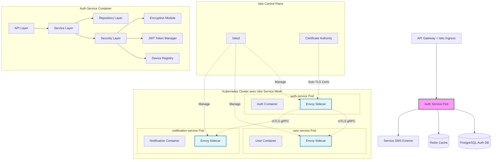

# Authentication Service (`auth-service`) - System Design Document

## 0. Sommaire

- [1. Introduction](#1-introduction)
  - [1.1 Objectif du Document](#11-objectif-du-document)
  - [1.2 Périmètre du Service](#12-périmètre-du-service)
  - [1.3 Relations avec les Autres Services](#13-relations-avec-les-autres-services)
- [2. Architecture Globale](#2-architecture-globale)
  - [2.1 Vue d'Ensemble de l'Architecture avec Istio Service Mesh](#21-vue-densemble-de-larchitecture-avec-istio-service-mesh)
  - [2.2 Principes Architecturaux](#22-principes-architecturaux)
- [3. Choix Technologiques](#3-choix-technologiques)
  - [3.1 Stack Technique](#31-stack-technique)
  - [3.2 Infrastructure](#32-infrastructure)
- [4. Composants Principaux](#4-composants-principaux)
  - [4.1 Structure NestJS](#41-structure-nestjs)
  - [4.2 Controllers (API Layer)](#42-controllers-api-layer)
  - [4.3 Services (Business Logic Layer)](#43-services-business-logic-layer)
  - [4.4 Repositories (Data Access Layer)](#44-repositories-data-access-layer)
  - [4.5 Guards et Interceptors (Security Layer)](#45-guards-et-interceptors-security-layer)
  - [4.6 Communication avec les autres services via Istio Service Mesh](#46-communication-avec-les-autres-services-via-istio-service-mesh)
    - [4.6.1 Configuration Istio pour auth-service](#461-configuration-istio-pour-auth-service)
  - [4.7 Configuration et Modules](#47-configuration-et-modules)
- [5. Scaling et Performances](#5-scaling-et-performances)
  - [5.1 Stratégie de Scaling](#51-stratégie-de-scaling)
  - [5.2 Cache et Optimisations](#52-cache-et-optimisations)
  - [5.3 Limites et Quotas avec Istio](#53-limites-et-quotas-avec-istio)
- [6. Monitoring et Observabilité](#6-monitoring-et-observabilité)
  - [6.1 Observabilité Istio](#61-observabilité-istio)
  - [6.2 Logging](#62-logging)
  - [6.3 Métriques](#63-métriques)
  - [6.4 Alerting](#64-alerting)
- [7. Gestion des Erreurs et Résilience](#7-gestion-des-erreurs-et-résilience)
  - [7.1 Stratégie de Gestion des Erreurs](#71-stratégie-de-gestion-des-erreurs)
  - [7.2 Résilience avec Istio](#72-résilience-avec-istio)
  - [7.3 Plan de Reprise d'Activité](#73-plan-de-reprise-dactivité)
- [8. Évolution et Maintenance](#8-évolution-et-maintenance)
  - [8.1 Versionnement](#81-versionnement)
  - [8.2 Mise à Jour et Déploiement](#82-mise-à-jour-et-déploiement)
  - [8.3 Documentation Technique](#83-documentation-technique)
- [9. Considérations Opérationnelles](#9-considérations-opérationnelles)
  - [9.1 DevOps](#91-devops)
  - [9.2 Environnements](#92-environnements)
  - [9.3 Support](#93-support)
- [Appendices](#appendices)
  - [A. Métriques de Performance Cibles](#a-métriques-de-performance-cibles)
  - [B. Estimation des Ressources](#b-estimation-des-ressources)
  - [C. Configuration Istio Examples](#c-configuration-istio-examples)
    - [C.1 PeerAuthentication (mTLS Strict)](#c1-peerauthentication-mtls-strict)
    - [C.2 AuthorizationPolicy pour auth-service](#c2-authorizationpolicy-pour-auth-service)
    - [C.3 DestinationRule avec Circuit Breaker](#c3-destinationrule-avec-circuit-breaker)
  - [D. Références](#d-références)

## 1. Introduction

### 1.1 Objectif du Document
Ce document décrit l'architecture et la conception technique du service d'authentification (`auth-service`) de l'application Whispr. Il sert de référence pour l'équipe de développement et les parties prenantes du projet.

### 1.2 Périmètre du Service
Le service `auth` est responsable de toutes les fonctionnalités liées à l'authentification des utilisateurs, à la gestion des appareils multi-device, à l'authentification à deux facteurs, et à la gestion des clés de chiffrement pour le protocole Signal (E2E). 


### 1.3 Relations avec les Autres Services
Ce service est fondamental dans l'architecture Whispr car il fournit **l'authentification** et **l'autorisation** pour tous les autres microservices. 

Il communique principalement avec:
- `user-service`: pour la gestion des profils utilisateurs (via gRPC over mTLS)
- `notification-service`: pour l'envoi des notifications push et gestion des appareils (via gRPC over mTLS)
- `Service SMS externe`: pour l'envoi des codes de vérification (Twilio, Vonage, etc.)
- Tous les autres services via l'API Gateway pour la validation des tokens

## 2. Architecture Globale

### 2.1 Vue d'Ensemble de l'Architecture avec Istio Service Mesh

Le service d'authentification fonctionne dans un service mesh Istio qui sécurise automatiquement toutes les communications inter-services :



### 2.2 Principes Architecturaux

- **Stateless**: Le service opère sans état pour faciliter le scaling horizontal
- **JWT-Based Authentication**: Utilisation exclusive de JSON Web Tokens pour l'authentification
- **Zero Trust Network**: Toutes les communications inter-services sont chiffrées et authentifiées via mTLS automatique
- **Service Mesh Security**: Sécurité implémentée au niveau infrastructure via Istio
- **Device-Centric**: Gestion des appareils multiples sans état serveur centralisé
- **Sécurité par Design**: Implémentation des meilleures pratiques de sécurité à chaque niveau
- **Résilience**: Gestion des défaillances avec graceful degradation via Istio
- **Observabilité**: Logging structuré, métriques détaillées et tracing distribué via Istio

## 3. Choix Technologiques

### 3.1 Stack Technique

- **Langage**: TypeScript
- **Framework**: NestJS (framework Node.js)
- **Authentication**: JWT stateless uniquement (RFC 7519)
- **Service Mesh**: Istio pour la sécurité et l'observabilité des communications inter-services
- **Proxy Sidecar**: Envoy (injecté automatiquement par Istio)
- **Sécurité Inter-Services**: mTLS automatique via Istio avec rotation de certificats
- **Base de données**: PostgreSQL pour les données persistantes d'authentification
- **Stockage temporaire**: Redis pour les données temporaires (codes de vérification, challenges, device registry)
- **Communication inter-services**: gRPC over mTLS automatique via Istio Service Mesh
- **ORM**: TypeORM pour PostgreSQL
- **Authentification**: JWT pour les tokens, bcrypt pour le hachage des secrets
- **Chiffrement**: librairies Signal Protocol officielles
- **API**: REST avec OpenAPI/Swagger (via décorateurs NestJS)
- **Cache**: Redis (via @nestjs/cache-manager)
- **Service SMS**: Intégration avec un service SMS externe (Twilio, Vonage, etc.)

### 3.2 Infrastructure

- **Containerisation**: Docker
- **Orchestration**: Kubernetes (GKE)
- **Service Mesh**: Istio avec injection automatique de sidecars Envoy
- **Security**: mTLS automatique, AuthorizationPolicies et NetworkPolicies Istio
- **CI/CD**: GitHub Actions
- **Service Cloud**: Google Cloud Platform (GCP)
- **Monitoring**: Prometheus + Grafana + Kiali (Istio service topology)
- **Logging**: Loki + accès logs Envoy
- **Tracing**: Jaeger (intégré avec Istio pour le tracing distribué)
- **Certificate Management**: Istio CA pour la rotation automatique des certificats mTLS

## 4. Composants Principaux

### 4.1 Structure NestJS

L'architecture NestJS du service est organisée comme suit:

```
src/
├── main.ts                    # Point d'entrée de l'application
├── app.module.ts              # Module racine
├── modules/                   # Modules fonctionnels
│   ├── auth/                  # Module d'authentification JWT
│   ├── verification/          # Module de vérification SMS
│   ├── twoFactor/             # Module 2FA
│   ├── keyManagement/         # Module de gestion des clés Signal
│   └── deviceRegistry/        # Module de gestion des appareils
├── shared/                    # Code partagé entre modules
│   ├── guards/                # Guards d'authentification JWT
│   ├── interceptors/          # Interceptors (logging, transformation)
│   ├── pipes/                 # Pipes de validation
│   ├── filters/               # Filtres d'exception
│   └── decorators/            # Décorateurs personnalisés
└── config/                    # Configuration de l'application
```

### 4.2 Controllers (API Layer)

Les Controllers NestJS exposent les endpoints RESTful:
- **AuthController**: endpoints d'enregistrement, login JWT et refresh tokens
- **VerificationController**: endpoints de vérification par SMS
- **TwoFactorController**: endpoints de gestion 2FA
- **KeyController**: endpoints de gestion des clés Signal
- **DeviceController**: endpoints de gestion des appareils multi-device

Avantages:
- Décorateurs pour définir les routes, méthodes HTTP et validation
- Génération automatique de la documentation Swagger via @nestjs/swagger
- Gestion des réponses HTTP standardisée

### 4.3 Services (Business Logic Layer)

Providers NestJS contenant la logique métier:
- **AuthService**: gestion des processus d'authentification JWT
- **JwtTokenService**: génération et validation des tokens JWT
- **VerificationService**: vérification par SMS
- **TwoFactorService**: gestion de l'authentification à deux facteurs
- **KeyManagementService**: gestion des clés pour le protocole Signal
- **DeviceRegistryService**: gestion du registre des appareils multi-device

Avantages:
- Injection de dépendances automatique
- Testabilité améliorée (facilité de mock)
- Séparation claire des responsabilités

### 4.4 Repositories (Data Access Layer)

Gère les accès aux données via TypeORM:
- **UserAuthRepository**: opérations liées aux utilisateurs d'authentification
- **KeyRepository**: opérations liées aux clés cryptographiques
- **VerificationRepository**: gestion des codes de vérification temporaires
- **LoginHistoryRepository**: historique des connexions pour audit

### 4.5 Guards et Interceptors (Security Layer)

Centralise les fonctionnalités de sécurité:
- **JwtAuthGuard**: validation des tokens JWT (stateless)
- **RateLimitInterceptor**: protection contre les attaques par force brute
- **TwoFactorGuard**: vérification de l'authentification à deux facteurs
- **DeviceValidationGuard**: validation des appareils multi-device
- **EncryptionService**: gestion du chiffrement Signal

### 4.6 Communication avec les autres services via Istio Service Mesh

- **@nestjs/microservices**: pour l'intégration gRPC avec les autres services
- **mTLS automatique**: Toutes les communications gRPC sont automatiquement sécurisées par Istio
- **Service Discovery**: Résolution automatique des services via Istio et Kubernetes DNS
- **Load Balancing**: Répartition de charge automatique par Envoy proxies
- Création d'interfaces gRPC pour les communications inter-services:
  - **Interface UserService**: récupération de profils, création d'utilisateurs
  - **Interface NotificationService**: envoi de notifications push, gestion des appareils

#### 4.6.1 Configuration Istio pour auth-service

```yaml
# AuthorizationPolicy pour permettre à auth-service d'appeler user-service
apiVersion: security.istio.io/v1beta1
kind: AuthorizationPolicy
metadata:
  name: auth-to-user-service
  namespace: whispr
spec:
  selector:
    matchLabels:
      app: user-service
  rules:
  - from:
    - source:
        principals: ["cluster.local/ns/whispr/sa/auth-service"]
  - to:
    - operation:
        methods: ["POST", "GET", "PUT"]
        paths: ["/user.UserService/*"]
```

### 4.7 Configuration et Modules

- **ConfigModule** (@nestjs/config): gestion des variables d'environnement
- **CacheModule**: intégration Redis pour le cache et les données temporaires
- **ThrottlerModule**: limitation de débit intégrée (complétée par Istio rate limiting)
- **JwtModule**: gestion des tokens JWT (STATELESS)
- **GrpcModule**: communication avec les autres microservices via Istio mTLS
- **HealthModule** (@nestjs/terminus): health checks pour Kubernetes et Istio

## 5. Scaling et Performances

### 5.1 Stratégie de Scaling

- **Horizontal Pod Autoscaling (HPA)**: Scaling automatique basé sur CPU/mémoire et métriques personnalisées
- **Istio Load Balancing**: Répartition intelligente de charge avec plusieurs algorithmes (round-robin, least request, etc.)
- **Circuit Breakers**: Protection automatique contre les cascades de pannes via Istio
- **Répliques multiples**: Instances complètement stateless facilitant le scaling illimité
- **Health Checks**: Intégration avec les probes Kubernetes et Istio

### 5.2 Cache et Optimisations

- **JWT Validation Caching**: Mise en cache des clés publiques de validation
- **Device Registry Cache**: Cache Redis des informations d'appareils actifs
- **Refresh Token Metadata**: Métadonnées en cache pour éviter les lookups DB
- **Connection Pooling**: Gestion optimisée des connexions via Envoy
- **Request Routing**: Routage intelligent des requêtes via Istio
- Optimisation des requêtes de base de données (indices appropriés)

### 5.3 Limites et Quotas avec Istio

- **Rate Limiting Istio**: Limitation de débit au niveau du service mesh
- **Per-User Rate Limiting**: Quotas personnalisés par utilisateur
- **Circuit Breaker Istio**: Protection automatique contre la surcharge
- Quotas sur les opérations sensibles (création de comptes, vérifications SMS)
- Timeout appropriés configurés via Istio VirtualService

## 6. Monitoring et Observabilité

### 6.1 Observabilité Istio

- **Kiali**: Visualisation de la topologie du service mesh et health des services
- **Jaeger**: Tracing distribué automatique de toutes les requêtes inter-services
- **Prometheus**: Collecte automatique des métriques Istio et custom metrics
- **Grafana**: Dashboards pour les métriques système et business
- **Envoy Access Logs**: Logs détaillés de toutes les communications

### 6.2 Logging

- Logs structurés en JSON via @nestjs/common Logger
- **Envoy Access Logs**: Logs automatiques de toutes les requêtes HTTP/gRPC
- **Distributed Tracing**: Corrélation automatique des logs via trace ID
- Utilisation du LoggingInterceptor NestJS pour le logging automatique des requêtes
- Niveaux de log différenciés (INFO, WARN, ERROR, DEBUG)
- Contexte inclus (userId, requestId, traceId, deviceId, etc.)
- Sensibilité aux données personnelles (masquage)

### 6.3 Métriques

- **Métriques Istio automatiques**:
  - Latence des requêtes inter-services
  - Taux de succès/erreur par service
  - Throughput des communications
  - Métriques de sécurité mTLS
- **Métriques métier personnalisées**:
  - Taux de réussite/échec des authentifications JWT
  - Nombre de tokens générés/validés par minute
  - Taux d'utilisation du device registry
  - Métriques de refresh token rotation

### 6.4 Alerting

- **Alertes Istio**:
  - Dégradation de la connectivité inter-services
  - Échecs de certificats mTLS
  - Latence élevée dans le service mesh
- **Alertes business**:
  - Taux d'échec anormal des validations JWT
  - Tentatives suspectes de refresh token
  - Épuisement des ressources

## 7. Gestion des Erreurs et Résilience

### 7.1 Stratégie de Gestion des Erreurs

- Utilisation des ExceptionFilters NestJS pour gérer les erreurs de manière centralisée
- Codes d'erreur standardisés via HttpException et dérivés personnalisés
- Messages d'erreur clairs mais sans divulgation d'informations sensibles
- Logging détaillé des erreurs pour le débogage
- **Correlation avec Istio tracing**: Chaque erreur est tracée dans Jaeger
- Possibilité d'enrichir les exceptions via les interceptors NestJS

### 7.2 Résilience avec Istio

- **Circuit Breakers Istio**: Protection automatique contre les services défaillants
- **Retry Policies**: Retries automatiques configurables via Istio VirtualService
- **Timeout Management**: Timeouts granulaires par service et opération
- **Outlier Detection**: Détection automatique et éviction des instances défaillantes
- **Traffic Shifting**: Basculement de trafic en cas de problème (blue/green, canary)
- **Fault Injection**: Tests de chaos intégrés pour validation de la résilience

### 7.3 Plan de Reprise d'Activité

- RPO (Recovery Point Objective): 1 heure max
- RTO (Recovery Time Objective): 2 heures max
- **Multi-AZ Deployment**: Déploiement dans plusieurs zones de disponibilité
- **Istio Multi-Cluster**: Préparation pour le déploiement multi-cluster si nécessaire
- Sauvegardes régulières de la base de données
- Procédures de restauration documentées

## 8. Évolution et Maintenance

### 8.1 Versionnement

- Versionnement sémantique des API
- **Traffic Routing Istio**: Déploiement progressif de nouvelles versions via traffic splitting
- **Canary Deployments**: Tests de nouvelles versions sur un pourcentage de trafic
- Rétrocompatibilité maintenue pour les clients existants
- Période de dépréciation avant suppression de fonctionnalités

### 8.2 Mise à Jour et Déploiement
- GitOps avec ArgoCD
- **Istio Rolling Updates**: Déploiement sans interruption via Istio
- **Blue/Green avec Istio**: Basculement de trafic instantané entre versions
- Tests automatisés avant déploiement
- Rollback automatique en cas d'échec via Istio traffic management
- Fenêtres de maintenance planifiées (si nécessaire)

### 8.3 Documentation Technique

- Documentation OpenAPI générée automatiquement via @nestjs/swagger et décorateurs
- **Documentation Istio**: Configurations des policies de sécurité et traffic management
- Exemples de code pour l'intégration
- Flux documentés pour les opérations complexes
- Guide de dépannage pour les problèmes courants
- Documentation automatique des DTO et entités via décorateurs Swagger

## 9. Considérations Opérationnelles

### 9.1 DevOps

- Pipeline CI/CD via GitHub Actions
- **Tests d'intégration Istio**: Validation des configurations service mesh
- **Security Scanning**: Analyse des configurations Istio pour les vulnérabilités
- Intégration continue avec tests automatisés
- Déploiement continu en environnement de développement et staging via ArgoCD

### 9.2 Environnements

- **Namespaces Kubernetes**: Isolation par environnement (dev, staging, prod)
- **Istio Traffic Management**: Routage par environnement
- **mTLS par environnement**: Certificats séparés par namespace
- Isolation complète des données entre environnements
- Parité des configurations Istio entre environnements

### 9.3 Support

- **Distributed Tracing**: Debugging facile via Jaeger
- **Service Topology**: Visualisation des dépendances via Kiali
- Logs centralisés pour le diagnostic
- **Istio Troubleshooting**: Outils intégrés pour diagnostiquer les problèmes de connectivité
- Procédures documentées pour les problèmes courants

---

## Appendices

### A. Métriques de Performance Cibles

| Métrique | Cible | Monitoring |
|----------|-------|------------|
| Temps de réponse moyen | < 200ms | Prometheus + Grafana |
| 99e percentile temps de réponse | < 1s | Istio + Jaeger |
| Taux d'erreur | < 0.1% | Kiali + Prometheus |
| Disponibilité | > 99% | Istio Health Checks |
| Temps moyen de vérification SMS | < 10s | Custom metrics |
| mTLS Success Rate | > 99.9% | Istio metrics |
| Inter-service latency | < 50ms | Envoy metrics |
| Certificate rotation | Automatique | Istio CA |
| JWT Validation latency | < 50ms | Custom metrics |
| Device Registry lookup | < 20ms | Redis metrics |

### B. Estimation des Ressources

| Ressource | Estimation Initiale | Istio Overhead |
|-----------|---------------------|----------------|
| Instances de service | 3 replicas | + Envoy sidecars |
| CPU par instance | 1 vCPU | + 0.1 vCPU (Envoy) |
| Mémoire par instance | 2 GB RAM | + 200MB (Envoy) |
| Stockage PostgreSQL | 20 GB initial | - |
| Stockage Redis | 2 GB | - |
| Bandwidth mensuel | 50 GB | + mTLS overhead (~5%) |
| Istio Control Plane | - | 1 vCPU, 1GB RAM |

### C. Configuration Istio Examples

#### C.1 PeerAuthentication (mTLS Strict)
```yaml
apiVersion: security.istio.io/v1beta1
kind: PeerAuthentication
metadata:
  name: default
  namespace: whispr
spec:
  mtls:
    mode: STRICT
```

#### C.2 AuthorizationPolicy pour auth-service
```yaml
apiVersion: security.istio.io/v1beta1
kind: AuthorizationPolicy
metadata:
  name: auth-service-policy
  namespace: whispr
spec:
  selector:
    matchLabels:
      app: auth-service
  rules:
  - from:
    - source:
        principals: ["cluster.local/ns/whispr/sa/api-gateway"]
  - to:
    - operation:
        methods: ["POST", "GET", "PUT", "DELETE"]
```

#### C.3 DestinationRule avec Circuit Breaker
```yaml
apiVersion: networking.istio.io/v1beta1
kind: DestinationRule
metadata:
  name: auth-service-circuit-breaker
  namespace: whispr
spec:
  host: auth-service
  trafficPolicy:
    outlierDetection:
      consecutiveErrors: 3
      interval: 30s
      baseEjectionTime: 30s
    circuitBreaker:
      maxConnections: 100
      maxRequestsPerConnection: 10
      maxRetries: 3
```

### D. Références

- [Spécification OpenAPI complète](../5_integration/swagger.yaml)
- [Schéma de sécurité Whispr](./security_policy.md)
- [Exigences non fonctionnelles](./non_fonctional_specs.md)
- [Documentation officielle NestJS](https://docs.nestjs.com/)
- [Bonnes pratiques NestJS](https://docs.nestjs.com/techniques/performance)
- [JWT RFC 7519](https://tools.ietf.org/html/rfc7519)
- [Istio Documentation](https://istio.io/latest/docs/)
- [Istio Security Best Practices](https://istio.io/latest/docs/ops/best-practices/security/)
- [Envoy Proxy Documentation](https://www.envoyproxy.io/docs/)