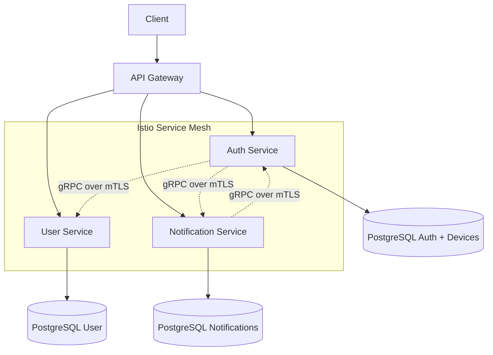
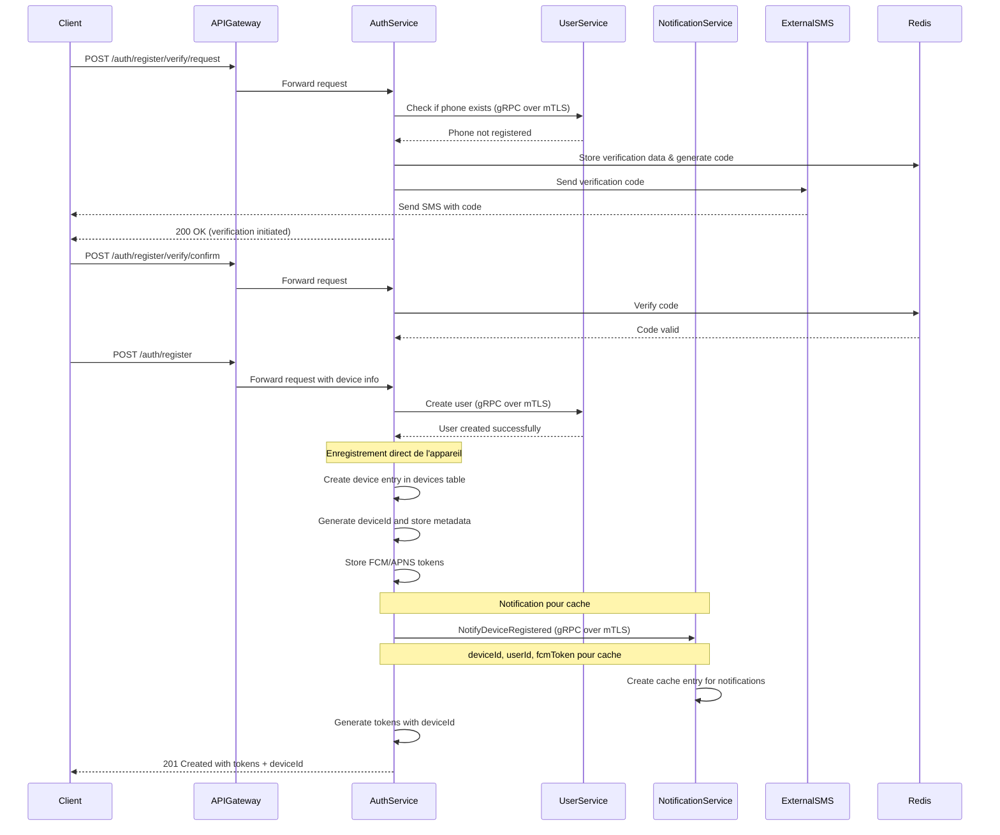
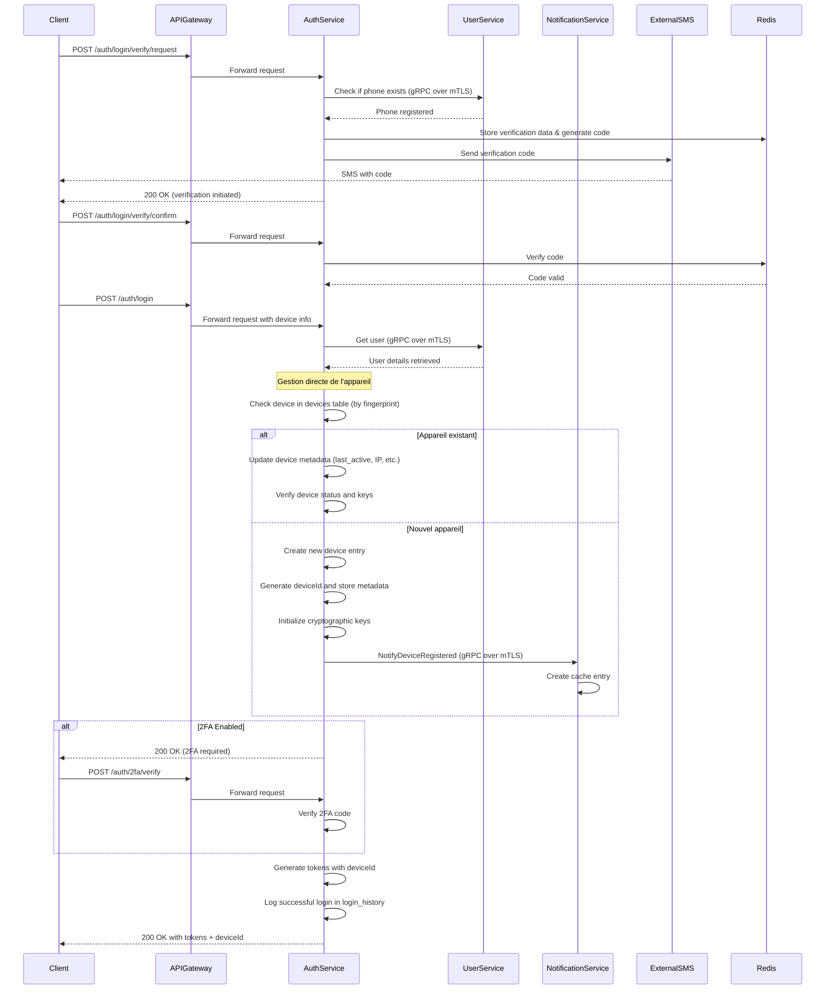
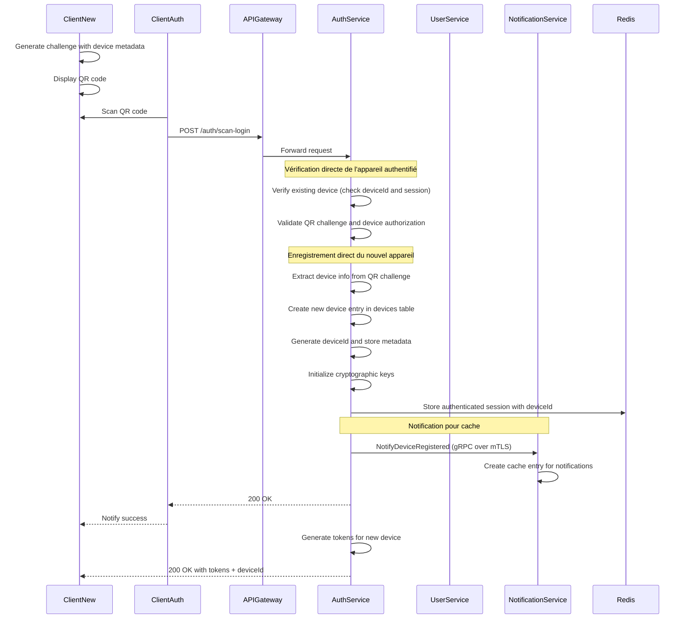

# Spécification Fonctionnelle - Authentification Whispr

## 0. Sommaire

- [1. Vue d'ensemble](#1-vue-densemble)
  - [1.1 Objectif](#11-objectif)
  - [1.2 Principes clés](#12-principes-clés)
  - [1.3 Composants fonctionnels](#13-composants-fonctionnels)
  - [1.4 Architecture des services](#14-architecture-des-services)
- [2. Processus d'inscription](#2-processus-dinscription)
  - [2.1 Explication du processus d'inscription](#21-explication-du-processus-dinscription)
  - [2.2 Mesures de sécurité](#22-mesures-de-sécurité)
- [3. Processus d'authentification](#3-processus-dauthentification)
  - [3.1 Explication du processus d'authentification](#31-explication-du-processus-dauthentification)
  - [3.2 Gestion des sessions](#32-gestion-des-sessions)
  - [3.3 Mesures de sécurité](#33-mesures-de-sécurité)
- [4. Authentification multi-appareils (QR Code)](#4-authentification-multi-appareils-qr-code)
  - [4.1 Explication de l'authentification par QR code](#41-explication-de-lauthentification-par-qr-code)
  - [4.2 Avantages sécuritaires](#42-avantages-sécuritaires)
- [5. Gestion des appareils intégrée](#5-gestion-des-appareils-intégrée)
  - [5.1 Responsabilités centralisées](#51-responsabilités-centralisées)
  - [5.2 Coordination avec les autres services](#52-coordination-avec-les-autres-services)
  - [5.3 Communication sécurisée](#53-communication-sécurisée)
- [6. Endpoints API](#6-endpoints-api)
  - [6.1 Endpoints d'authentification](#61-endpoints-dauthentification)
  - [6.2 Headers requis](#62-headers-requis)
  - [6.3 Réponses type](#63-réponses-type)
- [7. Tests](#7-tests)
  - [7.1 Tests unitaires](#71-tests-unitaires)
  - [7.2 Tests d'intégration inter-services](#72-tests-dintégration-inter-services)
  - [7.3 Tests de sécurité](#73-tests-de-sécurité)
- [8. Considérations opérationnelles](#8-considérations-opérationnelles)
  - [8.1 Monitoring et observabilité](#81-monitoring-et-observabilité)
  - [8.2 Gestion des pannes](#82-gestion-des-pannes)
  - [8.3 Scalabilité](#83-scalabilité)
- [Livrables](#livrables)
  - [Backend](#backend)
  - [Frontend](#frontend)
  - [Configuration](#configuration)

## 1. Vue d'ensemble

### 1.1 Objectif

Cette spécification détaille les fonctionnalités d'authentification de l'application Whispr. Elle couvre l'inscription des utilisateurs, la connexion standard et l'authentification multi-appareils via QR code. Ces fonctionnalités constituent le socle sécuritaire de l'application, permettant de garantir l'identité des utilisateurs tout en offrant une expérience utilisateur fluide.

### 1.2 Principes clés

- **Vérification par téléphone**: Confirmation de l'identité par code SMS
- **Sans mot de passe**: Utilisation exclusive de la vérification par téléphone et des tokens
- **Multi-appareils**: Possibilité de se connecter sur plusieurs appareils de manière sécurisée
- **Sécurité renforcée**: Support optionnel de la 2FA (détaillée dans une spécification séparée)
- **Tokens JWT**: Gestion des sessions via tokens d'accès et de rafraîchissement
- **Architecture centralisée**: auth-service comme autorité unique pour authentification et appareils
- **Coordination inter-services**: Séparation des responsabilités avec coordination sécurisée

### 1.3 Composants fonctionnels

Le système d'authentification comprend trois processus principaux:
1. **Inscription**: Vérification du numéro de téléphone et création de compte avec enregistrement d'appareil
2. **Connexion**: Authentification standard avec vérification par SMS et gestion d'appareil
3. **Authentification multi-appareils**: Connexion par scan de QR code avec enregistrement direct d'appareil

### 1.4 Architecture des services



**Responsabilités des services:**
- **auth-service**: Authentification, vérification SMS, tokens JWT, gestion complète des appareils, clés cryptographiques, sessions
- **user-service**: Profils utilisateurs, contacts, paramètres, préférences
- **notification-service**: Cache léger des tokens push, notifications, récupération d'infos d'appareils depuis auth-service

## 2. Processus d'inscription



### 2.1 Explication du processus d'inscription

#### Phase 1: Vérification du numéro de téléphone
1. **Demande de vérification**: L'utilisateur soumet son numéro de téléphone via l'application.
2. **Vérification de disponibilité**: 
   - Le service d'authentification communique avec le service utilisateur via gRPC over mTLS (sécurisé par Istio)
   - Vérifie que le numéro n'est pas déjà enregistré dans le système
3. **Génération du code**: 
   - Un code numérique à 6 chiffres est généré aléatoirement
   - Le code est haché et stocké dans Redis avec l'identifiant de vérification et le numéro
   - Un TTL de 15 minutes est appliqué pour limiter la validité temporelle du code
4. **Envoi du SMS**: 
   - Le code est envoyé via un service SMS externe (Twilio ou équivalent)
   - L'application affiche un message de confirmation d'envoi

#### Phase 2: Confirmation du code
1. **Saisie du code**: L'utilisateur entre le code reçu par SMS dans l'application.
2. **Validation**:
   - Le service récupère le hash du code stocké dans Redis avec l'identifiant de vérification
   - Compare le code soumis avec celui stocké (après application du même algorithme de hachage)
   - Vérifie que le code n'a pas expiré et que le nombre de tentatives maximum n'est pas dépassé
3. **Enregistrement de la validation**: 
   - Le statut de vérification est mis à jour dans Redis
   - Une période de validité de 60 minutes est accordée pour finaliser l'inscription

#### Phase 3: Création du compte et enregistrement de l'appareil
1. **Soumission des informations**: L'utilisateur complète son profil (nom, prénom, éventuellement photo) et fournit les informations d'appareil.
2. **Création du compte**:
   - Le service d'authentification vérifie que le numéro a bien été validé précédemment
   - Les données utilisateur sont transmises au service utilisateur via gRPC over mTLS
   - Le service utilisateur crée l'entrée dans sa base de données et attribue un UUID
   - Le service d'authentification crée l'entrée correspondante dans sa propre base
3. **Enregistrement direct de l'appareil dans auth-service**:
   - Le service d'authentification crée directement l'entrée dans la table devices
   - Génère un deviceId unique et stocke toutes les métadonnées (nom, type, fingerprint, clés publiques)
   - Stocke les tokens FCM/APNS pour les notifications
   - Initialise les clés cryptographiques pour le chiffrement E2E
4. **Notification pour synchronisation**:
   - Le service d'authentification notifie le notification-service du nouvel appareil
   - Transfère les informations essentielles (deviceId, userId, tokens) pour le cache de notifications
   - Le notification-service crée une entrée légère pour optimiser l'envoi de notifications
5. **Génération des tokens**: 
   - Un token d'accès (courte durée: 1 heure) est généré avec le deviceId
   - Un token de rafraîchissement (longue durée: 30 jours) est généré
   - Les deux tokens sont signés avec l'algorithme ES256
6. **Finalisation**: 
   - Les tokens et le deviceId sont renvoyés au client
   - L'utilisateur est authentifié et peut accéder à l'application

### 2.2 Mesures de sécurité
- **Rate limiting**: Maximum 5 demandes de vérification par numéro par heure
- **Expiration des codes**: Validité de 15 minutes pour limiter les fenêtres d'attaque
- **Tentatives limitées**: Maximum 5 tentatives de validation par code
- **Hachage des codes**: Les codes ne sont jamais stockés en clair
- **Validation séquentielle**: Impossible de créer un compte sans vérification préalable
- **Gestion centralisée des appareils**: Contrôle complet par auth-service pour la sécurité
- **Communications sécurisées**: Toutes les communications inter-services via mTLS automatique (Istio)

## 3. Processus d'authentification



### 3.1 Explication du processus d'authentification

#### Phase 1: Vérification du numéro
1. **Demande de vérification**: L'utilisateur soumet son numéro de téléphone pour se connecter.
2. **Vérification d'existence**: 
   - Le service authentification vérifie via gRPC over mTLS que le numéro est bien enregistré
   - Si le numéro n'existe pas, une erreur est retournée
3. **Génération et envoi du code**: 
   - Processus identique à celui de l'inscription
   - Un code à 6 chiffres est généré, haché et stocké
   - Le code est envoyé par SMS à l'utilisateur

#### Phase 2: Validation du code
1. **Vérification du code**: 
   - L'utilisateur saisit le code reçu
   - Le système vérifie la validité comme pour l'inscription
2. **Validation de l'identité**: 
   - La validation du code confirme que l'utilisateur possède bien le téléphone associé au compte

#### Phase 3: Gestion directe de l'appareil et connexion finale
1. **Identification/Enregistrement de l'appareil dans auth-service**: 
   - Le client envoie les informations de l'appareil (fingerprint, type, nom, token FCM/APNS)
   - Le service d'authentification vérifie directement dans sa table devices
   - Si l'appareil est reconnu (même fingerprint), il met à jour les métadonnées (dernière activité, IP, etc.)
   - Si c'est un nouvel appareil, il crée une nouvelle entrée avec un deviceId unique
   - Initialise ou vérifie les clés cryptographiques pour le E2E

2. **Notification pour cache de notifications**:
   - Si c'est un nouvel appareil, auth-service notifie le notification-service
   - Transfère les informations essentielles pour permettre l'envoi de notifications push
   - Le notification-service maintient un cache léger pour optimiser les performances

3. **Récupération des informations utilisateur**: 
   - Le service d'authentification interroge le service utilisateur pour obtenir les détails du compte
   - Le service vérifie si la 2FA est activée pour ce compte

4. **Vérification 2FA (si activée)**:
   - Si la 2FA est activée, une étape supplémentaire est requise
   - L'utilisateur doit fournir un code généré par son application d'authentification
   - Le processus détaillé est couvert dans la spécification 2FA

5. **Génération des tokens et finalisation**:
   - Des tokens JWT sont générés avec le deviceId inclus dans les claims
   - L'accès à l'application est accordé
   - La connexion est journalisée dans login_history avec le deviceId

### 3.2 Gestion des sessions
- **Token d'accès**: Validité courte (1 heure) pour limiter les risques de vol, contient le deviceId
- **Token de rafraîchissement**: Validité longue (30 jours) pour éviter les reconnexions fréquentes
- **Révocation centralisée**: Les tokens peuvent être révoqués directement par auth-service
- **Renouvellement transparent**: Le token d'accès peut être renouvelé automatiquement via le token de rafraîchissement
- **Lien avec l'appareil**: Chaque session est liée à un deviceId spécifique

### 3.3 Mesures de sécurité
- **Rate limiting renforcé**: Protection contre les attaques par force brute
- **Détection d'anomalies**: Alertes sur des connexions depuis des localisations inhabituelles
- **Journalisation complète**: Enregistrement des tentatives de connexion dans login_history avec informations d'appareil
- **Gestion centralisée**: Contrôle complet des appareils et sessions par auth-service
- **Communications sécurisées**: Toutes les communications inter-services via mTLS automatique (Istio)

## 4. Authentification multi-appareils (QR Code)



### 4.1 Explication de l'authentification par QR code

#### Phase 1: Initialisation sur le nouvel appareil
1. **Génération du challenge**: 
   - Le nouvel appareil génère un challenge cryptographique temporaire
   - Ce challenge contient un identifiant de session unique, une signature et les métadonnées complètes de l'appareil
   - Une durée de validité courte (5 minutes) est encodée dans le challenge
2. **Affichage du QR code**: 
   - Le challenge est encodé en QR code
   - Un écran d'attente est affiché avec instructions pour l'utilisateur

#### Phase 2: Scan et autorisation
1. **Scan par l'appareil authentifié**: 
   - L'utilisateur utilise un appareil déjà connecté pour scanner le QR code
   - L'application décode le challenge et extrait les informations
2. **Autorisation**: 
   - L'utilisateur confirme qu'il souhaite connecter le nouvel appareil
   - L'appareil authentifié envoie une requête au serveur contenant:
     - Le challenge scanné
     - Son propre token d'authentification
     - Des informations sur le nouvel appareil

#### Phase 3: Validation et enregistrement centralisés dans auth-service
1. **Vérification de l'appareil existant**: 
   - Le service d'authentification vérifie le token de l'appareil qui fait la demande
   - Vérifie directement dans sa table devices que l'appareil est bien enregistré et actif
   - Confirme que l'appareil a les droits pour autoriser de nouveaux appareils
2. **Validation du challenge**: 
   - Vérifie l'authenticité et la validité temporelle du challenge
   - S'assure qu'il n'a pas déjà été utilisé
3. **Enregistrement direct du nouvel appareil**:
   - Le service d'authentification extrait les métadonnées du nouvel appareil du challenge
   - Crée directement une nouvelle entrée dans la table devices
   - Génère un deviceId unique et stocke toutes les informations
   - Initialise les clés cryptographiques nécessaires pour le E2E
4. **Notification pour synchronisation**:
   - Informe le notification-service du nouvel appareil pour créer le cache de notifications
   - Transfère les informations essentielles (deviceId, tokens FCM/APNS)

#### Phase 4: Finalisation
1. **Confirmation à l'appareil authentifié**: 
   - Un message de succès est envoyé à l'appareil qui a scanné le QR
2. **Notification au nouvel appareil**: 
   - Le nouvel appareil est notifié que l'authentification est réussie
   - Des tokens JWT lui sont délivrés avec le deviceId inclus pour accéder à l'application
3. **Journalisation**: 
   - L'événement d'ajout d'appareil est enregistré dans login_history
   - L'opération est tracée pour l'audit

### 4.2 Avantages sécuritaires
- **Pas de saisie d'identifiants**: Réduit les risques de phishing et de vol de credentials
- **Double contrôle**: Nécessite un appareil déjà authentifié pour confirmer l'identité
- **Challenge à usage unique**: Empêche la réutilisation du QR code
- **Expiration rapide**: Limite la fenêtre temporelle d'attaque
- **Confirmation explicite**: L'utilisateur doit activement approuver l'ajout du nouvel appareil
- **Gestion centralisée**: Vérification et enregistrement complets par auth-service
- **Coordination sécurisée**: Communication avec notification-service pour le cache uniquement

## 5. Gestion des appareils intégrée

### 5.1 Responsabilités centralisées

Avec l'architecture centralisée, auth-service est la source de vérité unique pour tous les aspects liés aux appareils :

**Ce que fait le auth-service :**
- Authentification et validation des utilisateurs
- Génération et vérification des tokens JWT
- Gestion des codes de vérification SMS et 2FA
- **Stockage et gestion complète des métadonnées d'appareils**
- **Enregistrement et révocation d'appareils**
- **Gestion des clés cryptographiques par appareil**
- **Suivi de l'activité et du statut des appareils**
- **Historique des sessions par appareil via login_history**

**Ce que fait le notification-service :**
- Cache léger des informations d'appareils pour optimiser les notifications
- Envoi des notifications push
- Récupération d'informations d'appareils depuis auth-service via gRPC

**Ce que fait le user-service :**
- Stockage et gestion des profils utilisateurs
- Gestion des contacts et relations sociales
- Paramètres et préférences utilisateur

### 5.2 Coordination avec les autres services

Le service d'authentification coordonne avec les autres services selon ces patterns :

1. **Avec notification-service** :
   - **auth-service → notification-service** : Notification des événements d'appareils (ajout, suppression, mise à jour)
   - **notification-service → auth-service** : Récupération d'informations d'appareils pour l'envoi de notifications

2. **Avec user-service** :
   - **auth-service → user-service** : Récupération des profils et préférences utilisateur
   - **user-service → auth-service** : Notification des changements de profil nécessitant une synchronisation

### 5.3 Communication sécurisée

Toutes les communications entre les services utilisent :
- **gRPC over mTLS** : Protocole sécurisé géré automatiquement par Istio
- **AuthorizationPolicies** : Contrôles d'accès granulaires au niveau service mesh
- **Distributed Tracing** : Traçabilité complète des opérations via Jaeger
- **Circuit Breakers** : Protection automatique contre les pannes de services

Configuration exemple :
```yaml
# AuthorizationPolicy pour notification-service vers auth-service
apiVersion: security.istio.io/v1beta1
kind: AuthorizationPolicy
metadata:
  name: notification-to-auth
  namespace: whispr
spec:
  selector:
    matchLabels:
      app: auth-service
  rules:
  - from:
    - source:
        principals: ["cluster.local/ns/whispr/sa/notification-service"]
  - to:
    - operation:
        methods: ["GET"]
        paths: ["/auth.AuthService/GetDeviceTokens", "/auth.AuthService/GetUserDevices"]
```

## 6. Endpoints API

### 6.1 Endpoints d'authentification

| Endpoint | Méthode | Description | Services impliqués |
|----------|---------|-------------|-------------------|
| `/auth/register/verify/request` | POST | Demande de code de vérification pour inscription | auth-service → user-service |
| `/auth/register/verify/confirm` | POST | Confirmation du code de vérification | auth-service |
| `/auth/register` | POST | Finalisation de l'inscription avec enregistrement d'appareil | auth-service → user-service, notification-service |
| `/auth/login/verify/request` | POST | Demande de code de vérification pour connexion | auth-service → user-service |
| `/auth/login/verify/confirm` | POST | Confirmation du code de vérification | auth-service |
| `/auth/login` | POST | Finalisation de la connexion avec gestion d'appareil | auth-service → user-service, notification-service |
| `/auth/scan-login` | POST | Authentification par QR code avec enregistrement d'appareil | auth-service → notification-service |
| `/auth/logout` | POST | Déconnexion avec gestion de session d'appareil | auth-service → notification-service |
| `/auth/refresh` | POST | Renouvellement de token | auth-service |

### 6.2 Headers requis

- **Authorization**: `Bearer <access_token>` pour les endpoints protégés
- **X-Device-Info**: Informations sur l'appareil (fingerprint, type, etc.)
- **X-Request-ID**: Identifiant unique pour le tracing distribué

### 6.3 Réponses type

```json
{
  "success": true,
  "data": {
    "accessToken": "jwt_access_token",
    "refreshToken": "jwt_refresh_token",
    "deviceId": "uuid_device_id",
    "expiresIn": 3600
  }
}
```

## 7. Tests

### 7.1 Tests unitaires
- Génération et validation des codes de vérification
- Génération et validation des tokens JWT
- CRUD des appareils dans auth-service
- Logique d'authentification et gestion d'erreurs
- Communication avec les services externes (SMS)
- Gestion des clés cryptographiques

### 7.2 Tests d'intégration inter-services
- Communication auth-service ↔ user-service (gRPC over mTLS)
- Communication auth-service → notification-service (notifications d'événements)
- Communication notification-service → auth-service (récupération d'infos)
- Processus complet d'inscription avec enregistrement d'appareil intégré
- Processus complet de connexion avec gestion d'appareil directe
- Authentification par QR code avec enregistrement centralisé

### 7.3 Tests de sécurité
- Validation des communications mTLS entre services
- Tentatives d'accès non autorisées aux endpoints et données d'appareils
- Tests de rate limiting et protection contre les attaques par force brute
- Validation de l'intégrité des tokens JWT avec claims d'appareil
- Tests de résistance aux attaques par rejeu
- Sécurité de la gestion centralisée des appareils

## 8. Considérations opérationnelles

### 8.1 Monitoring et observabilité

- **Métriques Istio** : Latence et taux de succès des communications inter-services
- **Métriques auth-service** :
  - Taux de succès des authentifications
  - Performance de gestion des appareils
  - Utilisation des tokens et sessions
  - Santé des clés cryptographiques
- **Tracing distribué** : Suivi des requêtes à travers tous les services impliqués
- **Logs corrélés** : Logs structurés avec correlation IDs et deviceIds pour faciliter le debugging
- **Alertes** : Surveillance des pannes de communication entre services

### 8.2 Gestion des pannes

- **Circuit breakers** : Protection automatique contre les services défaillants
- **Retry policies** : Tentatives automatiques avec backoff exponentiel
- **Graceful degradation** : Modes dégradés quand notification-service ou user-service sont indisponibles
- **Health checks** : Vérifications de santé régulières des services
- **Fallback mechanisms** : Fonctionnement en mode dégradé pour l'authentification critique

### 8.3 Scalabilité

- **Scaling horizontal** : Chaque service peut être scalé indépendamment
- **Load balancing** : Répartition automatique de charge via Istio
- **Stateless design** : Services sans état pour faciliter le scaling
- **Cache distribué** : Redis pour les données temporaires partagées
- **Database optimization** : Index appropriés sur la table devices pour les performances

---

## Livrables

### Backend
- **AuthModule**: Module d'authentification principal (NestJS)
- **VerificationModule**: Module de vérification SMS et codes
- **TokenModule**: Module de gestion des tokens JWT
- **DeviceModule**: Module de gestion intégrée des appareils
- **QRAuthModule**: Module d'authentification par QR code
- **NotificationCoordinationModule**: Module de coordination avec notification-service

### Frontend
- **Écrans d'inscription**: Interface de création de compte avec enregistrement d'appareil
- **Écrans de connexion**: Interface de connexion standard avec gestion d'appareil
- **Interface QR**: Composant de scan et affichage de QR codes
- **Gestion d'erreurs**: Interface cohérente pour les erreurs d'authentification
- **Interface de gestion d'appareils**: Composants pour visualiser et gérer les appareils

### Configuration
- **Policies Istio**: Configurations AuthorizationPolicy et PeerAuthentication
- **Scripts de déploiement**: Automatisation du déploiement coordonné des services
- **Monitoring**: Dashboards et alertes pour l'observabilité
- **Database migrations**: Scripts de migration pour la table devices dans auth-service