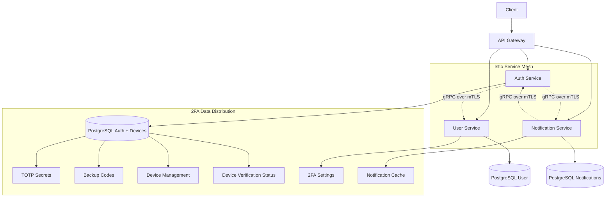
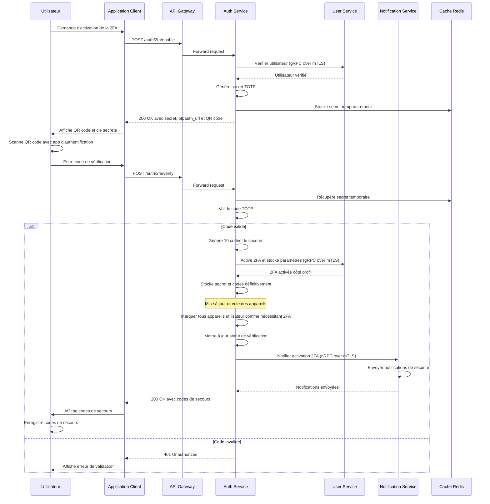
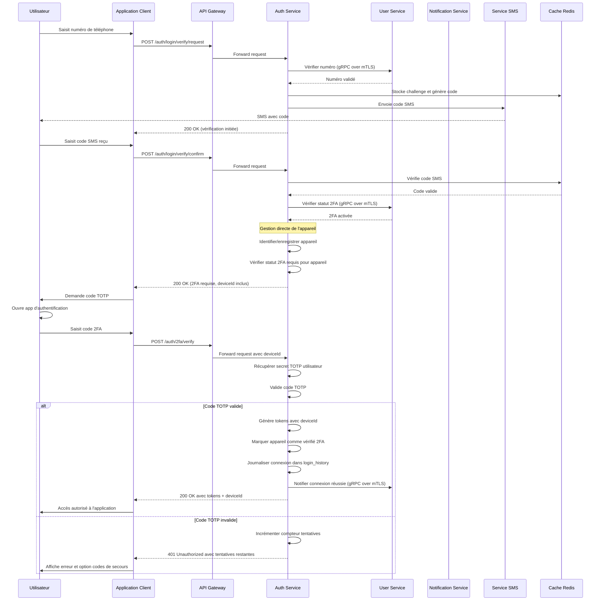
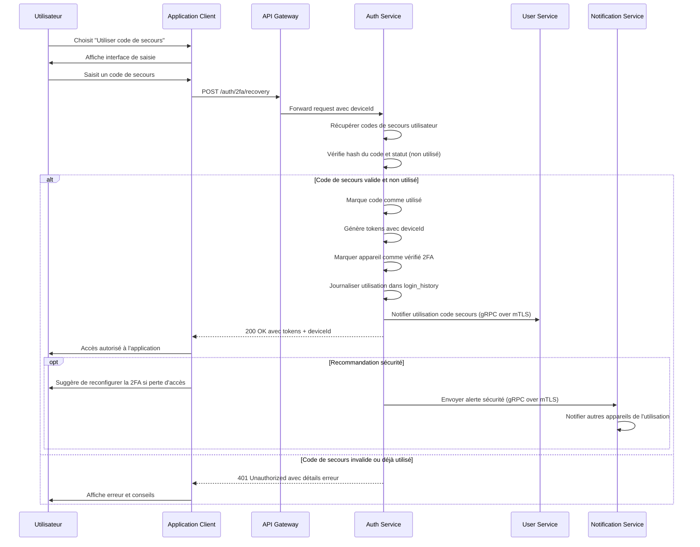
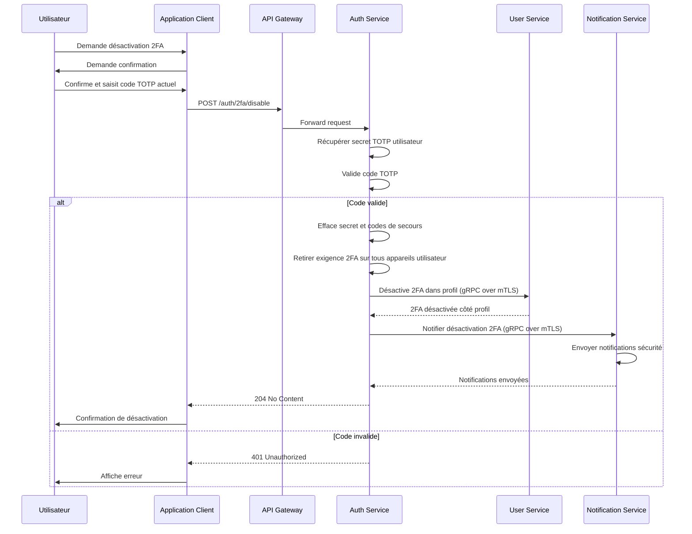
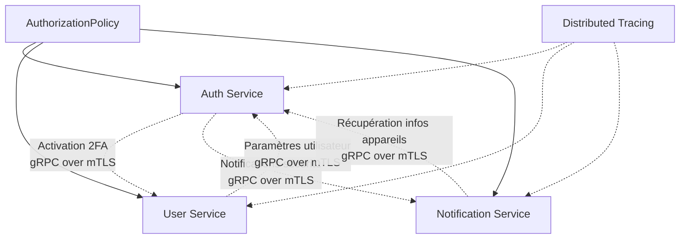
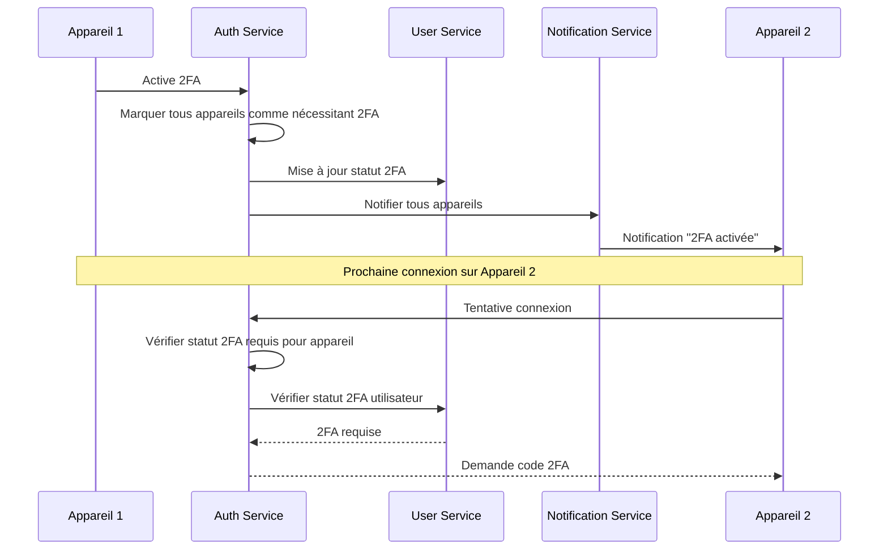

# Spécification Fonctionnelle - Authentification à Deux Facteurs (2FA)

## 0. Sommaire

- [1. Vue d'ensemble](#1-vue-densemble)
  - [1.1 Objectif](#11-objectif)
  - [1.2 Principes clés](#12-principes-clés)
  - [1.3 Composants fonctionnels](#13-composants-fonctionnels)
  - [1.4 Architecture des services](#14-architecture-des-services)
- [2. Flux d'activation de la 2FA](#2-flux-dactivation-de-la-2fa)
  - [2.1 Explication du flux d'activation](#21-explication-du-flux-dactivation)
- [3. Flux d'authentification avec 2FA activée](#3-flux-dauthentification-avec-2fa-activée)
  - [3.1 Explication du flux d'authentification](#31-explication-du-flux-dauthentification)
- [4. Flux d'utilisation des codes de secours](#4-flux-dutilisation-des-codes-de-secours)
  - [4.1 Explication de l'utilisation des codes de secours](#41-explication-de-lutilisation-des-codes-de-secours)
- [5. Désactivation de la 2FA](#5-désactivation-de-la-2fa)
  - [5.1 Explication de la désactivation](#51-explication-de-la-désactivation)
- [6. Spécifications techniques](#6-spécifications-techniques)
  - [6.1 Algorithme TOTP](#61-algorithme-totp)
  - [6.2 Codes de secours](#62-codes-de-secours)
  - [6.3 Sécurité](#63-sécurité)
  - [6.4 Expérience utilisateur](#64-expérience-utilisateur)
- [7. Considérations d'implémentation](#7-considérations-dimplémentation)
  - [7.1 Bibliothèques recommandées](#71-bibliothèques-recommandées)
  - [7.2 Structure de données](#72-structure-de-données)
  - [7.3 Endpoints API](#73-endpoints-api)
- [8. Communication inter-services](#8-communication-inter-services)
  - [8.1 Coordination avec les autres services](#81-coordination-avec-les-autres-services)
  - [8.2 Gestion des sessions multi-appareils](#82-gestion-des-sessions-multi-appareils)
  - [8.3 Synchronisation des paramètres 2FA](#83-synchronisation-des-paramètres-2fa)
- [9. Tests](#9-tests)
  - [9.1 Tests unitaires](#91-tests-unitaires)
  - [9.2 Tests d'intégration](#92-tests-dintégration)
  - [9.3 Tests de sécurité](#93-tests-de-sécurité)
- [10. Considérations opérationnelles](#10-considérations-opérationnelles)
  - [10.1 Monitoring et observabilité](#101-monitoring-et-observabilité)
  - [10.2 Gestion des pannes](#102-gestion-des-pannes)
  - [10.3 Scalabilité](#103-scalabilité)
- [11. Livrables](#11-livrables)
  - [11.1 Composants backend](#111-composants-backend)
  - [11.2 Composants frontend](#112-composants-frontend)
  - [11.3 Documentation](#113-documentation)

## 1. Vue d'ensemble

### 1.1 Objectif

L'authentification à deux facteurs (2FA) renforce la sécurité du processus d'authentification en ajoutant une deuxième couche de vérification, indépendante de la première. Pour Whispr, nous implémentons la 2FA basée sur TOTP (Time-based One-Time Password) conformément à la RFC 6238, compatible avec les applications d'authentification standard comme Google Authenticator, Microsoft Authenticator ou Authy.

### 1.2 Principes clés

- **Quelque chose que vous connaissez** (première couche): Vérification par SMS
- **Quelque chose que vous possédez** (deuxième couche): Code temporaire généré par une application d'authentification
- **Optionnalité**: La 2FA est proposée mais optionnelle pour les utilisateurs
- **Solution de secours**: Des codes de récupération sont fournis en cas de perte d'accès à l'application d'authentification
- **Multi-appareils**: Fonctionnement cohérent à travers tous les appareils de l'utilisateur
- **Architecture centralisée**: auth-service gère la 2FA et coordonne avec les autres services via Istio Service Mesh

### 1.3 Composants fonctionnels

Le système 2FA comprend quatre processus principaux:
1. **Activation de la 2FA**: Configuration initiale et liaison de l'application d'authentification
2. **Authentification avec 2FA**: Vérification du code temporaire lors de la connexion
3. **Gestion des codes de secours**: Génération, visualisation et utilisation des codes de récupération
4. **Synchronisation multi-appareils**: Cohérence des paramètres 2FA entre tous les appareils

### 1.4 Architecture des services



**Responsabilités pour la 2FA :**
- **auth-service**: Secrets TOTP, codes de secours, validation des codes, logique 2FA, gestion complète des appareils et statut de vérification
- **user-service**: Paramètres utilisateur 2FA (activé/désactivé), préférences
- **notification-service**: Cache léger pour notifications, récupération d'infos d'appareils depuis auth-service

## 2. Flux d'activation de la 2FA



### 2.1 Explication du flux d'activation

#### Phase de préparation
1. **Initiation**: L'utilisateur demande l'activation de la 2FA depuis les paramètres de sécurité.
2. **Vérification préalable**: Le service authentifie l'utilisateur et vérifie qu'il n'a pas déjà activé la 2FA.
3. **Génération du secret**: Un secret TOTP aléatoire de 20 octets est généré et encodé en Base32.
4. **Création de l'URL TOTP**: Une URL `otpauth://` est construite selon le format standard, incluant:
   - Le nom de l'application (Whispr)
   - L'identifiant de l'utilisateur (numéro de téléphone ou nom d'utilisateur)
   - Le secret TOTP
   - Les paramètres: algorithme (SHA1), période (30 secondes), digits (6)
5. **Génération du QR Code**: L'URL TOTP est encodée dans un QR code.

#### Phase de validation
1. **Association de l'application**: L'utilisateur scanne le QR code avec son application d'authentification.
2. **Vérification**: L'utilisateur saisit le code à 6 chiffres généré par l'application.
3. **Validation du code**: Le service vérifie que le code est correct, avec une fenêtre de tolérance de ±1 période (30s).
4. **Génération des codes de secours**: Si le code est valide, 10 codes de secours alphanumériques sont générés.
5. **Activation coordonnée**: 
   - Le secret TOTP et les codes de secours (hachés) sont stockés dans auth-service
   - Les paramètres utilisateur sont mis à jour dans user-service
   - Tous les appareils utilisateur sont marqués comme nécessitant 2FA directement dans auth-service
   - notification-service est informé pour envoyer des notifications de sécurité
6. **Confirmation**: Les codes de secours sont présentés une seule fois à l'utilisateur pour sauvegarde.

#### Coordination inter-services
- **auth-service**: Stocke les secrets cryptographiques, gère la validation et met à jour le statut des appareils
- **user-service**: Met à jour les préférences utilisateur (2FA activée)
- **notification-service**: Envoie des notifications de sécurité sur tous les appareils

## 3. Flux d'authentification avec 2FA activée



### 3.1 Explication du flux d'authentification

#### Première étape: Vérification du téléphone
1. **Identique au processus standard**: L'utilisateur suit le flux normal de vérification par SMS.
2. **Détection automatique**: Après validation du code SMS, le système détecte que l'utilisateur a activé la 2FA via user-service.

#### Deuxième étape: Vérification TOTP avec gestion centralisée des appareils
1. **Gestion directe de l'appareil**: auth-service identifie ou enregistre l'appareil utilisé dans sa propre table devices.
2. **Vérification du statut 2FA**: auth-service vérifie si l'appareil nécessite une vérification 2FA.
3. **Demande de code 2FA**: L'application demande à l'utilisateur de fournir le code de son application d'authentification.
4. **Génération du code**: L'utilisateur ouvre son application d'authentification qui génère un code à 6 chiffres basé sur:
   - Le secret partagé (stocké dans auth-service)
   - L'heure actuelle (arrondie à la période de 30 secondes)
5. **Vérification du code**: Le service:
   - Récupère le secret TOTP associé à l'utilisateur
   - Calcule le code attendu pour la période actuelle
   - Compare le code soumis avec le code attendu (avec tolérance)
6. **Finalisation centralisée**: Si le code est valide:
   - L'authentification est complétée avec génération de tokens JWT incluant deviceId
   - L'appareil est marqué comme vérifié 2FA directement dans auth-service
   - La connexion est journalisée dans login_history

#### Cas d'erreur et gestion des tentatives
- Si le code est invalide, l'utilisateur peut réessayer jusqu'à 5 fois avant blocage temporaire
- Après 5 tentatives infructueuses, l'utilisateur doit attendre 30 minutes ou utiliser un code de secours
- L'option des codes de secours est proposée dès la première erreur

## 4. Flux d'utilisation des codes de secours



### 4.1 Explication de l'utilisation des codes de secours

#### Processus de récupération
1. **Option de secours**: L'utilisateur sélectionne l'option "Utiliser un code de secours" s'il ne peut pas accéder à son application d'authentification.
2. **Saisie du code**: L'utilisateur entre l'un des 10 codes de secours qui lui ont été fournis lors de l'activation.
3. **Validation du code**: Le service:
   - Récupère les codes de secours hachés associés à l'utilisateur
   - Compare le hash du code soumis avec les hash stockés
   - Vérifie que le code n'a pas déjà été utilisé
4. **Utilisation à usage unique**: Chaque code ne peut être utilisé qu'une seule fois.
5. **Accès accordé avec gestion centralisée**: Si le code est valide:
   - L'utilisateur reçoit des tokens d'authentification avec deviceId
   - L'appareil est marqué comme vérifié 2FA dans auth-service
   - L'utilisation est journalisée dans login_history
6. **Notifications de sécurité**: 
   - L'utilisation est journalisée pour audit
   - Les autres appareils sont notifiés via notification-service
   - Recommandation de reconfigurer la 2FA en cas de perte d'accès

#### Gestion des codes de secours
- Les codes sont générés selon un format spécifique (ex: XXXX-XXXX-XXXX) facilitant la lecture
- Ils sont stockés uniquement sous forme hachée dans la base de données auth-service
- Chaque code a un indicateur d'utilisation (utilisé/non utilisé)
- L'utilisation d'un code est journalisée pour des raisons de sécurité

## 5. Désactivation de la 2FA



### 5.1 Explication de la désactivation

1. **Demande de désactivation**: L'utilisateur accède à l'option de désactivation dans les paramètres de sécurité.
2. **Confirmation de sécurité**: Pour confirmer son identité, l'utilisateur doit fournir un code TOTP valide de son application d'authentification.
3. **Validation du code**: Le système vérifie que le code est correct avant de procéder.
4. **Suppression centralisée des données**: Après validation, auth-service:
   - Supprime le secret TOTP associé à l'utilisateur
   - Supprime tous les codes de secours associés
   - Retire l'exigence 2FA sur tous les appareils utilisateur dans sa table devices
   - Met à jour le statut 2FA des appareils
5. **Coordination avec les autres services**:
   - Met à jour le statut 2FA de l'utilisateur dans user-service
   - Envoie des notifications de sécurité via notification-service
6. **Confirmation**: L'utilisateur reçoit une confirmation que la 2FA a été désactivée.

## 6. Spécifications techniques

### 6.1 Algorithme TOTP
- **Standard**: RFC 6238 (TOTP) et RFC 4226 (HOTP)
- **Algorithme de hachage**: HMAC-SHA1
- **Longueur du code**: 6 chiffres
- **Période**: 30 secondes
- **Fenêtre de tolérance**: ±1 période (permet d'accepter des codes générés 30 secondes avant/après)
- **Secret**: 20 octets (160 bits) aléatoires, encodés en Base32

### 6.2 Codes de secours
- **Nombre**: 10 codes
- **Format**: Alphanumériques, 12 caractères groupés par 4 (ex: ABCD-EFGH-IJKL)
- **Stockage**: Hachés avec bcrypt (facteur de coût 10)
- **Utilisation**: Usage unique avec marquage après utilisation

### 6.3 Sécurité
- **Rate limiting**: Maximum 5 tentatives de code 2FA par session
- **Blocage temporaire**: 30 minutes après 5 tentatives échouées
- **Journalisation**: Toutes les opérations 2FA sont journalisées dans auth-service
- **Notification**: L'utilisateur est notifié sur tous ses appareils lors de l'activation/désactivation de la 2FA
- **Communications sécurisées**: Toutes les communications inter-services via mTLS automatique (Istio)

### 6.4 Expérience utilisateur
- **Instructions claires**: Guide pas à pas pour l'activation
- **Applications recommandées**: Liste d'applications d'authentification compatibles
- **Test de validation**: Vérification du code avant finalisation
- **Rappels**: Importance de sauvegarder les codes de secours
- **Accessibilité**: Option de saisie manuelle du secret si le QR code ne peut être scanné
- **Synchronisation**: État 2FA cohérent sur tous les appareils

## 7. Considérations d'implémentation

### 7.1 Bibliothèques recommandées
- **Node.js**: `otplib` pour la génération et validation TOTP
- **Frontend**: `qrcode` pour la génération des QR codes
- **Hachage**: `bcrypt` pour les codes de secours
- **gRPC**: `@nestjs/microservices` pour les communications inter-services

### 7.2 Structure de données

#### Table users_auth (PostgreSQL - auth-service)
```sql
ALTER TABLE users_auth
ADD COLUMN two_factor_secret VARCHAR(255),
ADD COLUMN two_factor_enabled BOOLEAN NOT NULL DEFAULT FALSE;
```

#### Table devices (PostgreSQL - auth-service) - Ajout statut 2FA
```sql
ALTER TABLE devices
ADD COLUMN requires_2fa BOOLEAN NOT NULL DEFAULT FALSE,
ADD COLUMN last_2fa_verification TIMESTAMP,
ADD COLUMN two_factor_verified BOOLEAN NOT NULL DEFAULT FALSE;
```

#### Table backup_codes (PostgreSQL - auth-service)
```sql
CREATE TABLE backup_codes (
    id UUID PRIMARY KEY DEFAULT uuid_generate_v4(),
    user_id UUID NOT NULL REFERENCES users_auth(id) ON DELETE CASCADE,
    code_hash VARCHAR(255) NOT NULL,
    used BOOLEAN NOT NULL DEFAULT FALSE,
    created_at TIMESTAMP NOT NULL DEFAULT NOW(),
    used_at TIMESTAMP
);
CREATE INDEX idx_backup_codes_user_id ON backup_codes(user_id);
```

#### Table users (PostgreSQL - user-service) - Ajout paramètres 2FA
```sql
ALTER TABLE users
ADD COLUMN two_factor_enabled BOOLEAN NOT NULL DEFAULT FALSE,
ADD COLUMN two_factor_enabled_at TIMESTAMP,
ADD COLUMN security_notifications_enabled BOOLEAN NOT NULL DEFAULT TRUE;
```

### 7.3 Endpoints API

| Endpoint | Méthode | Description | Services impliqués |
|----------|---------|-------------|-------------------|
| `/auth/me/2fa-status` | GET | Obtenir le statut 2FA | auth-service → user-service |
| `/auth/2fa/enable` | POST | Initier l'activation 2FA | auth-service |
| `/auth/2fa/verify` | POST | Vérifier code TOTP | auth-service → user-service, notification-service |
| `/auth/2fa/disable` | POST | Désactiver 2FA | auth-service → user-service, notification-service |
| `/auth/2fa/recovery` | POST | Utiliser code de secours | auth-service → user-service, notification-service |
| `/auth/2fa/backup-codes` | GET | Obtenir nouveaux codes de secours | auth-service |

## 8. Communication inter-services

### 8.1 Coordination avec les autres services

La 2FA nécessite une coordination étroite entre les services via Istio Service Mesh :



**Types de communications :**
- **Activation/Désactivation** : auth-service coordonne avec user-service et notification-service
- **Authentification** : Vérification du statut 2FA via user-service
- **Gestion des appareils** : auth-service gère directement, notifie notification-service
- **Notifications** : Alertes de sécurité via notification-service
- **Synchronisation** : État 2FA cohérent géré par auth-service

### 8.2 Gestion des sessions multi-appareils



**Caractéristiques multi-appareils :**
- **Gestion centralisée** : auth-service gère le statut 2FA de tous les appareils
- **Synchronisation immédiate** : Activation 2FA propagée à tous les appareils
- **Notifications push** : Alertes de sécurité en temps réel via notification-service
- **Sessions coordonnées** : Tous les appareils requièrent 2FA après activation
- **Journalisation centralisée** : Traçabilité complète dans auth-service

### 8.3 Synchronisation des paramètres 2FA

```yaml
# AuthorizationPolicy pour communications 2FA
apiVersion: security.istio.io/v1beta1
kind: AuthorizationPolicy
metadata:
  name: auth-2fa-coordination
  namespace: whispr
spec:
  selector:
    matchLabels:
      app: user-service
  rules:
  - from:
    - source:
        principals: ["cluster.local/ns/whispr/sa/auth-service"]
  - to:
    - operation:
        methods: ["POST", "PUT", "GET"]
        paths: ["/user.UserService/Update2FAStatus", "/user.UserService/Get2FASettings"]

---
# AuthorizationPolicy pour notification-service vers auth-service
apiVersion: security.istio.io/v1beta1
kind: AuthorizationPolicy
metadata:
  name: notification-to-auth-devices
  namespace: whispr
spec:
  selector:
    matchLabels:
      app: auth-service
  rules:
  - from:
    - source:
        principals: ["cluster.local/ns/whispr/sa/notification-service"]
  - to:
    - operation:
        methods: ["GET"]
        paths: ["/auth.AuthService/GetUserDevices", "/auth.AuthService/GetDevice2FAStatus"]
```

## 9. Tests

### 9.1 Tests unitaires
- Validation des algorithmes TOTP avec différentes fenêtres temporelles
- Génération et validation des codes de secours
- Vérifications des fenêtres de tolérance temporelle
- Tests des fonctions de hachage et sécurité
- Gestion du statut 2FA des appareils

### 9.2 Tests d'intégration
- Flux complet d'activation/désactivation avec coordination inter-services
- Scénarios d'authentification avec 2FA entre services
- Utilisation des codes de secours avec journalisation centralisée
- Communication gRPC over mTLS entre auth-service et autres services
- Synchronisation des notifications sur plusieurs appareils
- Gestion centralisée des appareils avec statut 2FA

### 9.3 Tests de sécurité
- Tentatives de contournement du rate limiting
- Validation des réponses d'erreur sans fuite d'information
- Vérification de l'expiration des codes temporaires
- Tests de résistance aux attaques par rejeu
- Validation des communications mTLS entre services
- Sécurité de la gestion centralisée des statuts 2FA

## 10. Considérations opérationnelles

### 10.1 Monitoring et observabilité

- **Métriques Istio** : Latence et taux de succès des communications 2FA inter-services
- **Métriques métier** :
  - Taux d'activation/désactivation 2FA
  - Utilisation des codes de secours
  - Tentatives d'authentification 2FA (succès/échec)
  - Performance des validations TOTP
  - Statut 2FA des appareils
- **Tracing distribué** : Suivi des opérations 2FA à travers tous les services
- **Alertes** : Pics d'utilisation de codes de secours, pannes de synchronisation

### 10.2 Gestion des pannes

- **Circuit breakers** : Protection contre les pannes de user-service ou notification-service
- **Retry policies** : Tentatives automatiques pour les opérations de synchronisation
- **Graceful degradation** : Mode dégradé si notification-service indisponible
- **Rollback procedures** : Procédures de récupération en cas de désynchronisation
- **Centralized state** : État 2FA maintenu dans auth-service pour la résilience

### 10.3 Scalabilité

- **Scaling horizontal** : auth-service peut être scalé indépendamment
- **Cache Redis** : Mise en cache des secrets TOTP pour les validations fréquentes
- **Load balancing** : Répartition automatique de charge via Istio
- **Stateless design** : Aucun état persistant en mémoire
- **Optimized queries** : Index appropriés sur tables devices pour performance

## 11. Livrables

### 11.1 Composants backend
- **TwoFactorModule**: Module de gestion TOTP principal (NestJS)
- **BackupCodesModule**: Module de gestion des codes de secours
- **2FADeviceModule**: Module de gestion du statut 2FA des appareils
- **2FAIntegrationModule**: Module d'intégration avec user-service et notification-service
- **QRCodeModule**: Module de génération de QR codes
- **SecurityNotificationModule**: Module de notifications de sécurité

### 11.2 Composants frontend
- **Écrans d'activation/désactivation 2FA**: Interface complète de gestion
- **Affichage QR code**: Composant de génération et affichage
- **Saisie code TOTP**: Interface de validation des codes
- **Gestion codes de secours**: Affichage et conseils de sauvegarde
- **Notifications sécurité**: Alertes coordonnées multi-appareils
- **Status 2FA appareils**: Interface pour visualiser le statut par appareil

### 11.3 Documentation
- **Spécification d'implémentation**: Guide détaillé pour les développeurs
- **Diagrammes cryptographiques**: Illustrations des processus TOTP
- **Documentation API**: Reference pour l'intégration avec les autres modules
- **Guide de sécurité**: Bonnes pratiques pour la manipulation des secrets
- **Protocoles de vérification**: Instructions pour la validation cryptographique
- **Guide utilisateur**: Explications des fonctionnalités pour les utilisateurs
- **Procédures de récupération**: Instructions en cas de perte d'accès
- **Configurations Istio**: Exemples de policies pour la sécurité inter-services
- **Architecture centralisée**: Documentation de la gestion centralisée des appareils