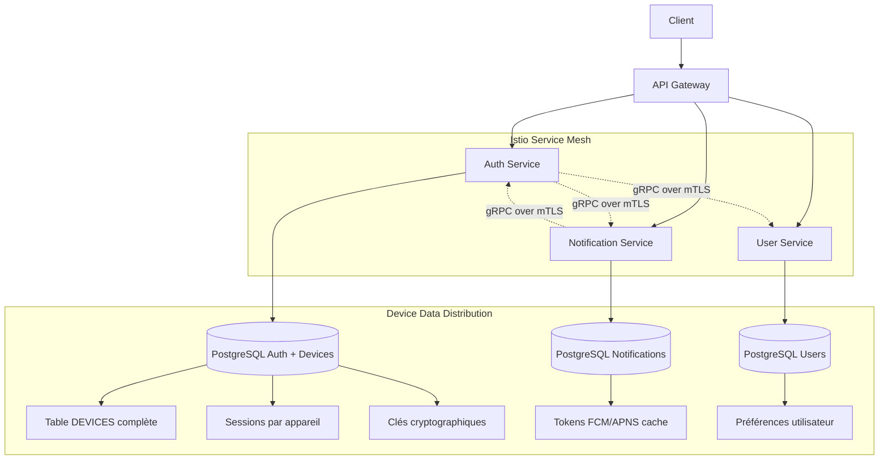
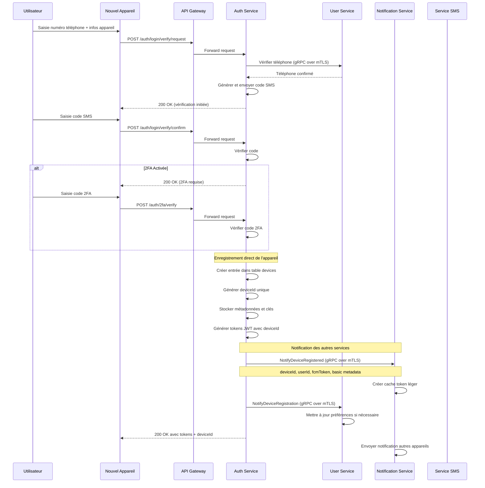
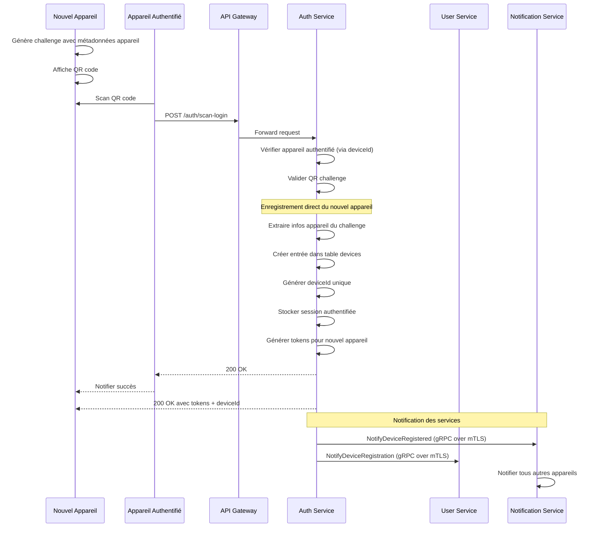
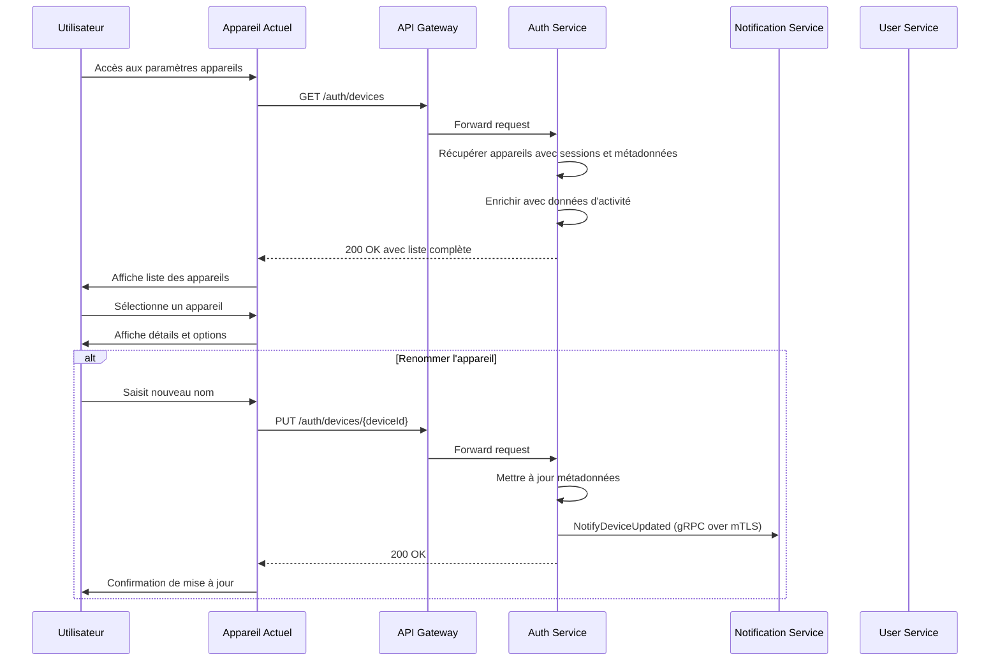
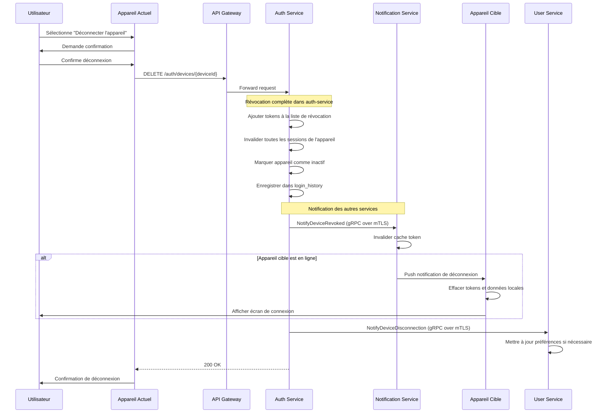
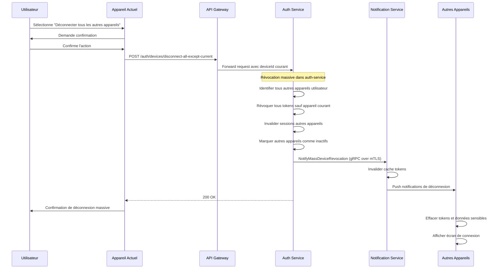
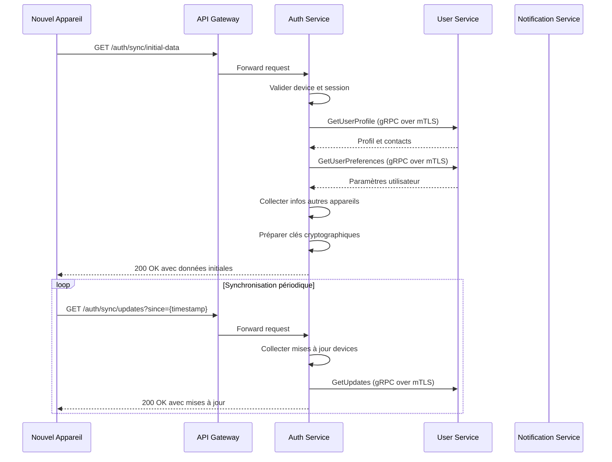
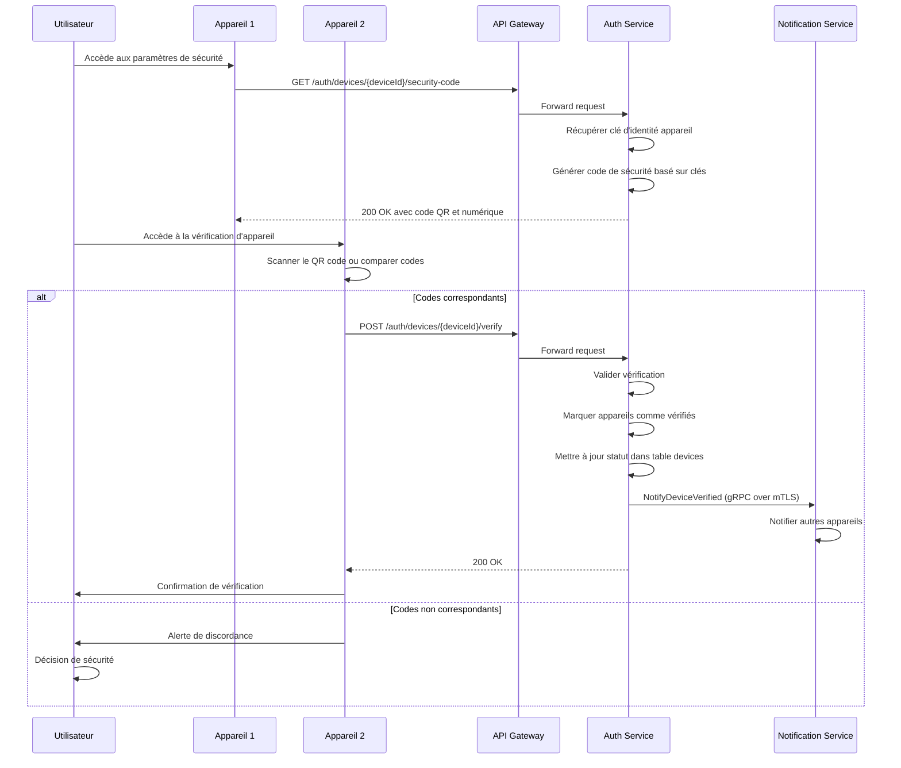
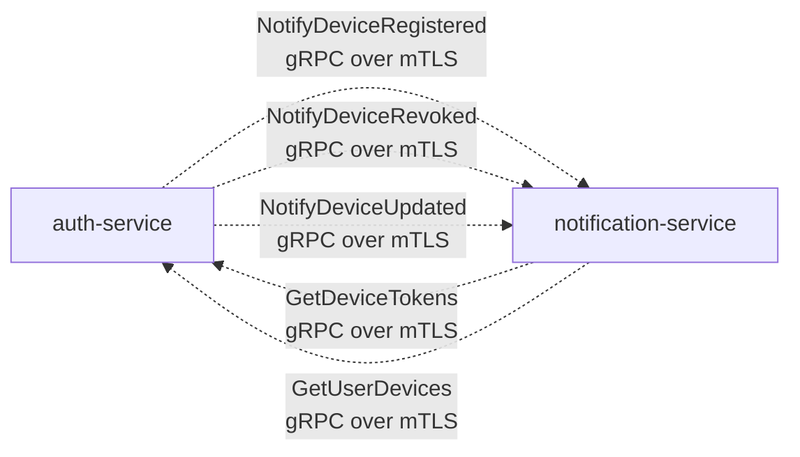
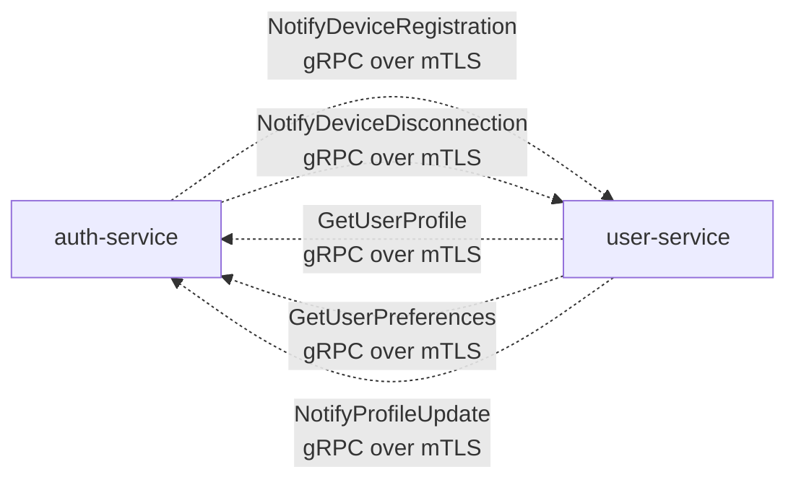

# Spécification Fonctionnelle - Gestion des Appareils

## 0. Sommaire

- [1. Vue d'ensemble](#1-vue-densemble)
  - [1.1 Objectif](#11-objectif)
  - [1.2 Principes clés](#12-principes-clés)
  - [1.3 Composants fonctionnels](#13-composants-fonctionnels)
  - [1.4 Architecture des services](#14-architecture-des-services)
- [2. Enregistrement d'un nouvel appareil](#2-enregistrement-dun-nouvel-appareil)
  - [2.1 Méthodes d'enregistrement](#21-méthodes-denregistrement)
  - [2.2 Métadonnées d'appareil](#22-métadonnées-dappareil)
  - [2.3 Initialisation et synchronisation](#23-initialisation-et-synchronisation)
- [3. Gestion des appareils connectés](#3-gestion-des-appareils-connectés)
  - [3.1 Interface de gestion des appareils](#31-interface-de-gestion-des-appareils)
  - [3.2 Statut et activité des appareils](#32-statut-et-activité-des-appareils)
  - [3.3 Indicateurs de sécurité](#33-indicateurs-de-sécurité)
- [4. Déconnexion à distance](#4-déconnexion-à-distance)
  - [4.1 Déconnexion d'un appareil spécifique](#41-déconnexion-dun-appareil-spécifique)
  - [4.2 Déconnexion de tous les autres appareils](#42-déconnexion-de-tous-les-autres-appareils)
  - [4.3 Effets de la déconnexion](#43-effets-de-la-déconnexion)
- [5. Synchronisation entre appareils](#5-synchronisation-entre-appareils)
  - [5.1 Données synchronisées](#51-données-synchronisées)
  - [5.2 Stratégies de synchronisation](#52-stratégies-de-synchronisation)
  - [5.3 Gestion des conflits](#53-gestion-des-conflits)
- [6. Vérification de sécurité entre appareils](#6-vérification-de-sécurité-entre-appareils)
  - [6.1 Vérification des clés d'identité](#61-vérification-des-clés-didentité)
  - [6.2 Codes de sécurité](#62-codes-de-sécurité)
  - [6.3 États de vérification](#63-états-de-vérification)
- [7. Aspects techniques](#7-aspects-techniques)
  - [7.1 Structure de données](#71-structure-de-données)
  - [7.2 Endpoints API](#72-endpoints-api)
  - [7.3 Notifications push](#73-notifications-push)
- [8. Communication inter-services](#8-communication-inter-services)
  - [8.1 Coordination avec notification-service](#81-coordination-avec-notification-service)
  - [8.2 Synchronisation avec user-service](#82-synchronisation-avec-user-service)
  - [8.3 Gestion des événements distribuée](#83-gestion-des-événements-distribuée)
- [9. Tests](#9-tests)
  - [9.1 Tests unitaires](#91-tests-unitaires)
  - [9.2 Tests d'intégration](#92-tests-dintégration)
  - [9.3 Tests de sécurité](#93-tests-de-sécurité)
- [10. Considérations opérationnelles](#10-considérations-opérationnelles)
  - [10.1 Monitoring et observabilité](#101-monitoring-et-observabilité)
  - [10.2 Gestion des pannes](#102-gestion-des-pannes)
  - [10.3 Scalabilité](#103-scalabilité)
- [11. Livrables](#11-livrables)
  - [11.1 Composants backend](#111-composants-backend)
  - [11.2 Composants frontend](#112-composants-frontend)
  - [11.3 Documentation](#113-documentation)

## 1. Vue d'ensemble

### 1.1 Objectif

Cette spécification détaille les fonctionnalités de gestion des appareils de l'application Whispr, permettant aux utilisateurs de gérer plusieurs terminaux connectés à leur compte. 

Ce module est essentiel pour l'expérience multi-appareils sécurisée et pour le chiffrement de bout en bout, chaque appareil devant être correctement enregistré et disposer des clés cryptographiques appropriées.

La gestion des appareils est centralisée dans le **auth-service**, qui devient le service principal responsable de toutes les opérations CRUD sur les appareils, de l'authentification, des sessions et des clés cryptographiques.

### 1.2 Principes clés

- **Centralisation sécurisée**: auth-service comme source unique de vérité pour les appareils et l'authentification
- **Transparence**: L'utilisateur a une visibilité complète sur tous les appareils connectés à son compte
- **Contrôle**: Possibilité de révoquer l'accès à distance pour n'importe quel appareil
- **Sécurité renforcée**: Appareils vérifiés et authentifiés individuellement avec gestion des clés intégrée
- **Expérience utilisateur fluide**: Synchronisation transparente coordonnée entre services
- **Communications sécurisées**: Toutes les interactions via gRPC over mTLS (Istio)
- **Autorité centralisée**: auth-service gère authentification, appareils et clés cryptographiques

### 1.3 Composants fonctionnels

Le système de gestion des appareils comprend cinq processus principaux:
1. **Enregistrement d'appareil**: Ajout d'un nouvel appareil au compte utilisateur via auth-service
2. **Gestion des appareils**: Visualisation et contrôle des appareils connectés
3. **Déconnexion à distance**: Révocation d'accès gérée par auth-service
4. **Synchronisation**: Transfert et mise à jour des données coordonnées entre services
5. **Vérification de sécurité**: Confirmation de l'identité des appareils pour le E2E

### 1.4 Architecture des services



**Responsabilités pour la gestion des appareils :**
- **auth-service**: Source de vérité pour appareils, CRUD complet, authentification, sessions, clés cryptographiques
- **notification-service**: Cache léger des tokens, notifications push, demande d'infos à auth-service
- **user-service**: Paramètres utilisateur liés aux appareils, préférences de synchronisation

**Flux de données principaux :**
- **Enregistrement** : Client → auth-service (gestion directe)
- **Authentification** : Client → auth-service (autorité complète)
- **Gestion** : Client → auth-service (APIs /auth/devices/*)
- **Notifications** : notification-service → auth-service (récupération d'infos)

## 2. Enregistrement d'un nouvel appareil

### 2.1 Méthodes d'enregistrement

L'application supporte trois méthodes principales d'ajout d'un nouvel appareil, toutes gérées directement par auth-service :

1. **Enregistrement lors de l'authentification directe** : Via le processus standard de vérification par SMS
2. **Authentification par QR code** : Méthode privilégiée utilisant un appareil déjà connecté
3. **Enregistrement manuel** : Via l'interface de gestion des appareils

### 2.2 Enregistrement lors de l'authentification directe



### 2.3 Authentification par QR code



### 2.4 Métadonnées d'appareil

Lors de l'enregistrement dans auth-service, les informations suivantes sont collectées:

- **Identifiants** :
  - deviceId (UUID généré par auth-service)
  - userId (référence utilisateur auth)
  - deviceFingerprint (empreinte unique calculée côté client)

- **Métadonnées descriptives** :
  - Nom de l'appareil : Défini par l'utilisateur ou généré automatiquement
  - Type d'appareil : iOS, Android, Web
  - Modèle d'appareil : Détecté automatiquement (ex: "iPhone 15", "Pixel 8")
  - Système d'exploitation : Version détectée automatiquement
  - Version de l'application : Pour compatibility checks

- **Configuration notifications** :
  - Token FCM/APNS : Stocké dans auth-service et partagé avec notification-service
  - Préférences de notification : Types de notifications autorisées

- **Données de sécurité** :
  - Clé publique de l'appareil : Pour le chiffrement E2E
  - Adresse IP d'enregistrement : Pour la journalisation de sécurité
  - Localisation approximative : Basée sur l'IP (pays/ville)
  - Date d'enregistrement : Horodatage UTC
  - Statut de vérification : Non vérifié par défaut

### 2.5 Initialisation et synchronisation

Après enregistrement dans auth-service, un nouvel appareil doit :

1. **Recevoir son deviceId** : Identifiant unique attribué par auth-service
2. **Configurer les clés cryptographiques** : Génération et stockage des clés Signal
3. **Synchroniser les données initiales** : Coordination avec user-service pour profil et contacts
4. **Configurer les notifications** : Communication du token FCM/APNS à notification-service
5. **Marquer comme actif** : Mise à jour du statut dans auth-service

## 3. Gestion des appareils connectés

### 3.1 Interface de gestion des appareils

L'application fournit une interface dédiée permettant à l'utilisateur de gérer ses appareils via auth-service :



**Fonctionnalités de l'interface :**
- **Visualiser tous les appareils** : Liste complète avec métadonnées et statut d'activité
- **Détails par appareil** : Nom, modèle, dernière activité, statut de session
- **Identifier l'appareil courant** : Marquage visuel de l'appareil actuel
- **Renommer les appareils** : Modification des noms personnalisés
- **Voir l'historique** : Dernières connexions et activités (depuis login_history)
- **Gérer les clés cryptographiques** : Statut et régénération des clés Signal
- **Actions de sécurité** : Déconnexion, vérification, révocation

### 3.2 Statut et activité des appareils

Pour chaque appareil, auth-service suit :

- **Statut de connexion** : En ligne / Hors ligne / Inconnu (basé sur les sessions actives)
- **Dernière activité** : Horodatage de la dernière interaction authentifiée
- **Version de l'application** : Pour identifier les appareils nécessitant une mise à jour
- **Santé des clés** : État des clés cryptographiques Signal
- **Historique des sessions** : Connexions et déconnexions via login_history
- **Statut de vérification** : État de vérification des clés d'identité

### 3.3 Indicateurs de sécurité

L'interface affiche des indicateurs visuels pour :

- **Appareils non vérifiés** : Appareils dont les clés n'ont pas été confirmées
- **Activité suspecte** : Connexions depuis des localisations inhabituelles
- **Appareils inactifs** : Appareils non utilisés depuis longtemps
- **Clés expirées** : Appareils nécessitant une rotation des clés cryptographiques
- **Sessions anormales** : Patterns de connexion suspects
- **Versions obsolètes** : Appareils avec des versions d'application anciennes

## 4. Déconnexion à distance

### 4.1 Déconnexion d'un appareil spécifique



### 4.2 Déconnexion de tous les autres appareils



### 4.3 Effets de la déconnexion

Lorsqu'un appareil est déconnecté via auth-service :

1. **Actions auth-service** :
   - Révocation de tous les tokens d'accès et de rafraîchissement
   - Invalidation des sessions actives dans la base auth
   - Ajout à la liste noire des tokens
   - Marquage de l'appareil comme inactif
   - Enregistrement dans login_history

2. **Coordination avec notification-service** :
   - Notification de révocation d'appareil
   - Invalidation du cache de tokens
   - Envoi de notification push si l'appareil est en ligne

3. **Effacement local** :
   - L'application efface les tokens et données sensibles sur l'appareil
   - Nettoyage du cache local des clés cryptographiques

4. **Journalisation et audit** :
   - L'action est enregistrée dans login_history par auth-service
   - Notification aux autres appareils via notification-service
   - Synchronisation avec user-service pour les préférences

## 5. Synchronisation entre appareils

### 5.1 Données synchronisées

La synchronisation est orchestrée par auth-service en coordination avec les autres services :



**Types de données synchronisées** :
- **Profil utilisateur** : Informations de base du profil (via user-service)
- **Liste de contacts** : Contacts de l'utilisateur (via user-service)
- **Paramètres de confidentialité** : Préférences de vie privée (via user-service)
- **Liste des appareils** : Métadonnées des appareils connectés (auth-service)
- **Clés cryptographiques** : Clés Signal et état de vérification (auth-service)
- **Sessions et authentification** : État des sessions par appareil (auth-service)

### 5.2 Stratégies de synchronisation

auth-service utilise plusieurs stratégies :

1. **Synchronisation initiale** : Lors de la première connexion d'un appareil
2. **Synchronisation push** : Notifications en temps réel via notification-service
3. **Synchronisation pull** : Demandes périodiques pour récupérer les mises à jour
4. **Synchronisation à la demande** : L'utilisateur peut forcer une synchronisation
5. **Synchronisation événementielle** : Déclenchée par des événements spécifiques

### 5.3 Gestion des conflits

En cas de modifications concurrentes :

- **Règle du dernier écrivain** : La dernière modification est généralement prioritaire
- **Résolution par fusion** : Pour certains types de données (listes, collections)
- **Notification à l'utilisateur** : Pour les conflits nécessitant une intervention manuelle
- **Journalisation** : Les conflits sont enregistrés pour analyse et débogage
- **Autorité auth-service** : Les conflits d'appareils sont résolus par auth-service

## 6. Vérification de sécurité entre appareils

### 6.1 Vérification des clés d'identité

Pour garantir la sécurité des communications E2E, les appareils d'un même utilisateur doivent se vérifier mutuellement via auth-service :



### 6.2 Codes de sécurité

Un code de sécurité est généré par auth-service basé sur les clés cryptographiques :

1. **Format numérique** : Séquence de chiffres facilement comparable (ex: "12-34-56-78-90-12")
2. **Format QR** : Code QR encodant les informations de vérification
3. **Empreinte visuelle** : Représentation graphique unique (similaire à Signal)
4. **Basé sur les clés d'identité** : Utilise les clés stockées dans auth-service

### 6.3 États de vérification

Un appareil peut avoir l'un des statuts suivants dans auth-service :

- **Non vérifié** : État initial après enregistrement
- **Vérifié** : Clés confirmées par l'utilisateur
- **En attente de vérification** : Vérification demandée mais non confirmée
- **Rejeté** : Appareil explicitement marqué comme non fiable
- **Révoqué** : Appareil dont l'accès a été révoqué

## 7. Aspects techniques

### 7.1 Structure de données

#### Table devices (PostgreSQL dans auth-service)
```sql
CREATE TABLE devices (
    id UUID PRIMARY KEY DEFAULT uuid_generate_v4(),
    user_id UUID NOT NULL REFERENCES users_auth(id) ON DELETE CASCADE,
    device_name VARCHAR(100) NOT NULL,
    device_type VARCHAR(20) NOT NULL,
    device_fingerprint VARCHAR(255) UNIQUE NOT NULL,
    model VARCHAR(100),
    os_version VARCHAR(50),
    app_version VARCHAR(20),
    fcm_token VARCHAR(255),
    apns_token VARCHAR(255),
    public_key TEXT NOT NULL,
    last_active TIMESTAMP NOT NULL DEFAULT NOW(),
    ip_address VARCHAR(45),
    registration_ip VARCHAR(45),
    is_verified BOOLEAN NOT NULL DEFAULT FALSE,
    is_active BOOLEAN NOT NULL DEFAULT TRUE,
    verification_status VARCHAR(20) NOT NULL DEFAULT 'unverified',
    security_metadata JSONB DEFAULT '{}',
    created_at TIMESTAMP NOT NULL DEFAULT NOW(),
    updated_at TIMESTAMP NOT NULL DEFAULT NOW()
);

CREATE INDEX idx_devices_user_id ON devices(user_id);
CREATE INDEX idx_devices_is_active ON devices(is_active);
CREATE INDEX idx_devices_device_fingerprint ON devices(device_fingerprint);
CREATE INDEX idx_devices_last_active ON devices(last_active);
CREATE INDEX idx_devices_verification_status ON devices(verification_status);
```

#### Table device_verifications (PostgreSQL dans auth-service)
```sql
CREATE TABLE device_verifications (
    id UUID PRIMARY KEY DEFAULT uuid_generate_v4(),
    verifier_device_id UUID NOT NULL REFERENCES devices(id),
    verified_device_id UUID NOT NULL REFERENCES devices(id),
    verification_status VARCHAR(20) NOT NULL,
    verification_date TIMESTAMP,
    security_code_hash VARCHAR(255),
    created_at TIMESTAMP NOT NULL DEFAULT NOW(),
    updated_at TIMESTAMP NOT NULL DEFAULT NOW(),
    UNIQUE(verifier_device_id, verified_device_id)
);

CREATE INDEX idx_device_verifications_verifier ON device_verifications(verifier_device_id);
CREATE INDEX idx_device_verifications_verified ON device_verifications(verified_device_id);
```

#### Table notification_tokens (PostgreSQL dans notification-service)
```sql
-- notification-service: table légère pour cache des tokens
CREATE TABLE notification_tokens (
    id UUID PRIMARY KEY DEFAULT uuid_generate_v4(),
    device_id UUID NOT NULL, -- Référence vers auth-service.devices
    user_id UUID NOT NULL,   -- Référence vers user-service.users
    fcm_token VARCHAR(255),
    apns_token VARCHAR(255),
    notification_preferences JSONB DEFAULT '{}',
    is_active BOOLEAN DEFAULT TRUE,
    last_sync_at TIMESTAMP DEFAULT NOW(),
    created_at TIMESTAMP DEFAULT NOW(),
    updated_at TIMESTAMP DEFAULT NOW()
);

CREATE INDEX idx_notification_tokens_device_id ON notification_tokens(device_id);
CREATE INDEX idx_notification_tokens_user_id ON notification_tokens(user_id);
CREATE INDEX idx_notification_tokens_is_active ON notification_tokens(is_active);
```

### 7.2 Endpoints API

| Endpoint | Méthode | Description | Service responsable |
|----------|---------|-------------|-------------------|
| `/auth/devices` | GET | Liste tous les appareils de l'utilisateur | auth-service |
| `/auth/devices` | POST | Enregistre un nouvel appareil | auth-service |
| `/auth/devices/{deviceId}` | GET | Obtient les détails d'un appareil | auth-service |
| `/auth/devices/{deviceId}` | PUT | Met à jour les informations d'un appareil | auth-service |
| `/auth/devices/{deviceId}` | DELETE | Déconnecte un appareil | auth-service |
| `/auth/devices/disconnect-all-except-current` | POST | Déconnecte tous les autres appareils | auth-service |
| `/auth/devices/{deviceId}/security-code` | GET | Obtient le code de sécurité pour vérification | auth-service |
| `/auth/devices/{deviceId}/verify` | POST | Marque un appareil comme vérifié | auth-service |
| `/auth/sync/initial-data` | GET | Récupère les données initiales pour un nouvel appareil | auth-service |
| `/auth/sync/updates` | GET | Récupère les mises à jour depuis un horodatage | auth-service |

### 7.3 Notifications push

notification-service gère les notifications push mais récupère les informations d'appareils depuis auth-service :

- **Connexion d'un nouvel appareil** : Alerte de sécurité sur tous les autres appareils
- **Déconnexion à distance** : Pour effacer les données locales de l'appareil cible
- **Modification des clés** : Pour mettre à jour les clés de chiffrement
- **Changement de statut de vérification** : Mise à jour du statut des appareils
- **Forçage de synchronisation** : Demande de synchronisation immédiate
- **Alertes de sécurité** : Activité suspecte ou tentatives d'accès non autorisées

## 8. Communication inter-services

### 8.1 Coordination avec notification-service



**Interactions principales :**
- **Notification d'événements** : auth-service informe notification-service des changements d'appareils
- **Récupération de tokens** : notification-service récupère les informations FCM/APNS depuis auth-service
- **Synchronisation de cache** : notification-service maintient un cache léger basé sur auth-service
- **Push notifications** : notification-service envoie les notifications avec données d'auth-service

### 8.2 Synchronisation avec user-service



**Interactions principales :**
- **Données utilisateur** : auth-service récupère profil et contacts depuis user-service pour synchronisation
- **Notifications d'événements** : auth-service informe user-service des changements d'appareils
- **Préférences** : coordination des paramètres utilisateur liés aux appareils
- **Mises à jour de profil** : user-service informe auth-service des changements à synchroniser

### 8.3 Gestion des événements distribuée

```yaml
# AuthorizationPolicy pour notification-service vers auth-service
apiVersion: security.istio.io/v1beta1
kind: AuthorizationPolicy
metadata:
  name: notification-to-auth-devices
  namespace: whispr
spec:
  selector:
    matchLabels:
      app: auth-service
  rules:
  - from:
    - source:
        principals: ["cluster.local/ns/whispr/sa/notification-service"]
  - to:
    - operation:
        methods: ["GET"]
        paths: ["/auth.AuthService/GetDeviceTokens", "/auth.AuthService/GetUserDevices"]

---
# AuthorizationPolicy pour auth-service vers user-service
apiVersion: security.istio.io/v1beta1
kind: AuthorizationPolicy
metadata:
  name: auth-to-user-sync
  namespace: whispr
spec:
  selector:
    matchLabels:
      app: user-service
  rules:
  - from:
    - source:
        principals: ["cluster.local/ns/whispr/sa/auth-service"]
  - to:
    - operation:
        methods: ["GET", "POST"]
        paths: ["/user.UserService/GetProfile", "/user.UserService/GetPreferences", "/user.UserService/NotifyDevice*"]
```

## 9. Tests

### 9.1 Tests unitaires
- CRUD des appareils dans auth-service
- Génération et validation des codes de sécurité
- Logique de synchronisation des données
- Gestion des clés cryptographiques
- Validation des métadonnées d'appareil
- Révocation de tokens et sessions

### 9.2 Tests d'intégration
- Enregistrement d'appareil dans auth-service avec notification des autres services
- Synchronisation complète entre plusieurs appareils via auth-service
- Processus de vérification croisée avec clés gérées par auth-service
- Déconnexion à distance et propagation des événements
- Communication gRPC over mTLS entre tous les services
- Gestion des pannes de services dépendants

### 9.3 Tests de sécurité
- Tentatives d'usurpation d'identité d'appareil
- Accès non autorisé aux métadonnées d'autres appareils via auth-service
- Prévention de l'énumération des appareils
- Tentatives de réutilisation de tokens révoqués
- Validation des communications mTLS entre services
- Tests de résistance aux attaques par rejeu

## 10. Considérations opérationnelles

### 10.1 Monitoring et observabilité

- **Métriques Istio** : Latence et taux de succès des communications inter-services
- **Métriques auth-service** :
  - Nombre d'appareils actifs par utilisateur
  - Taux de succès d'enregistrement d'appareils
  - Performance des synchronisations
  - Gestion des clés cryptographiques
  - Performance des révocations de tokens
- **Métriques de coordination** :
  - Latence des appels gRPC depuis notification-service et user-service
  - Taux d'échec des opérations distribuées
  - Performance des vérifications de sécurité
- **Tracing distribué** : Suivi des opérations à travers tous les services impliqués

### 10.2 Gestion des pannes

- **Circuit breakers** : Protection contre les pannes de notification-service ou user-service
- **Retry policies** : Tentatives automatiques pour les opérations inter-services
- **Graceful degradation** : Mode dégradé quand services dépendants indisponibles
- **Rollback procedures** : Procédures de récupération en cas de désynchronisation
- **Health checks** : Vérifications de santé régulières des services

### 10.3 Scalabilité

- **Scaling horizontal** : auth-service peut être scalé indépendamment
- **Load balancing** : Répartition automatique de charge via Istio
- **Database sharding** : Partitionnement possible par user_id si nécessaire
- **Cache distribué** : Redis pour les données fréquemment consultées
- **Optimisation des requêtes** : Index appropriés et requêtes optimisées

## 11. Livrables

### 11.1 Composants backend
- **DeviceManagementModule** : Module principal de gestion des appareils (NestJS dans auth-service)
- **DeviceSyncModule** : Module de synchronisation des données (auth-service)
- **DeviceVerificationModule** : Module de vérification de sécurité (auth-service)
- **DeviceCoordinationModule** : Module de coordination avec notification-service
- **UserSyncModule** : Module d'intégration avec user-service
- **CryptographicKeysModule** : Gestion des clés Signal intégrée

### 11.2 Composants frontend
- **Écran de gestion des appareils** : Interface listant tous les appareils
- **Écran de détails d'appareil** : Informations et options par appareil
- **Module de vérification** : Interface de vérification des codes de sécurité
- **Gestionnaire de synchronisation** : Logique de synchronisation côté client
- **Moniteur d'état de connexion** : Composant affichant l'état des appareils
- **Interface de sécurité** : Gestion des clés et vérifications

### 11.3 Documentation
- **Guide d'implémentation** : Instructions pour les développeurs
- **Guide utilisateur** : Explications des fonctionnalités pour les utilisateurs
- **Documentation API** : Spécifications des endpoints auth-service
- **Diagrammes de séquence** : Flux d'interactions détaillés inter-services
- **Procédures de sécurité** : Protocoles pour la gestion des incidents
- **Configurations Istio** : Exemples de policies pour sécuriser les communications
- **Guide de déploiement** : Instructions pour le déploiement coordonné des services