# Spécification Fonctionnelle - Chiffrement E2E (Signal Protocol)

## 1. Vue d'ensemble

### 1.1 Objectif

Cette spécification détaille l'implémentation du chiffrement de bout en bout (E2E) dans l'application Whispr basé sur le protocole Signal. Le chiffrement E2E garantit que seuls les participants d'une conversation peuvent lire les messages échangés, même si l'infrastructure serveur est compromise. Ce système constitue le fondement de la sécurité et de la confidentialité des communications au sein de l'application.

### 1.2 Principes fondamentaux

- **Confidentialité de bout en bout**: Les messages ne peuvent être déchiffrés que par les destinataires prévus
- **Forward secrecy**: La compromission d'une clé ne permet pas de déchiffrer les messages passés
- **Future secrecy**: Le système se remet automatiquement d'une compromission potentielle
- **Authentification**: Vérification cryptographique des participants à une conversation
- **Deniability**: Impossibilité de prouver cryptographiquement qu'un message provient d'un expéditeur spécifique
- **Support multidevices**: Fonctionnement cohérent à travers plusieurs appareils d'un même utilisateur gérés par auth-service

### 1.3 Composants du système

Le système de chiffrement E2E se compose de plusieurs éléments clés:

1. **Double Ratchet Algorithm**: Algorithme central de dérivation et rotation des clés
2. **Curve25519**: Cryptographie à courbe elliptique pour l'échange de clés Diffie-Hellman
3. **Triple Diffie-Hellman (X3DH)**: Protocole d'établissement de session initiale
4. **HKDF**: Fonction de dérivation de clés basée sur HMAC
5. **AES-256**: Chiffrement symétrique des messages
6. **HMAC-SHA256**: Authentification des messages
7. **Système de prékeys**: Permettant l'établissement asynchrone de sessions, géré par auth-service

## 2. Architecture du Protocole Signal

### 2.1 Vue d'ensemble des composants cryptographiques

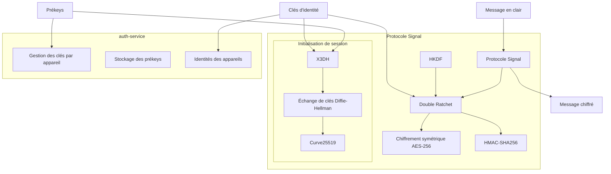

### 2.2 Types de clés

Le protocole Signal utilise plusieurs types de clés cryptographiques, toutes gérées par auth-service:

1. **Clé d'identité (Identity Key)**: 
   - Paire de clés Curve25519 à long terme
   - Identifie de manière unique un utilisateur ou un appareil
   - La clé privée ne quitte jamais l'appareil
   - La clé publique est stockée et gérée par auth-service

2. **Clés préalables signées (Signed Prekeys)**:
   - Paires de clés Curve25519 semi-persistantes
   - Générées sur l'appareil et signées avec la clé d'identité
   - Stockées et gérées par auth-service avec la signature
   - Rotation périodique (typiquement tous les 7 jours)

3. **Clés préalables à usage unique (One-Time Prekeys)**:
   - Paires de clés Curve25519 à usage unique
   - Générées à l'avance en grand nombre (typiquement 100)
   - Stockées et distribuées par auth-service
   - Utilisées une seule fois pour établir une session
   - Supprimées d'auth-service après utilisation

4. **Clés de chaîne (Chain Keys)**:
   - Clés symétriques dérivées pendant le processus de Double Ratchet
   - Utilisées pour dériver les clés de message

5. **Clés de message (Message Keys)**:
   - Clés symétriques dérivées des clés de chaîne
   - Utilisées une seule fois pour chiffrer/déchiffrer un message

### 2.3 Hiérarchie de dérivation des clés

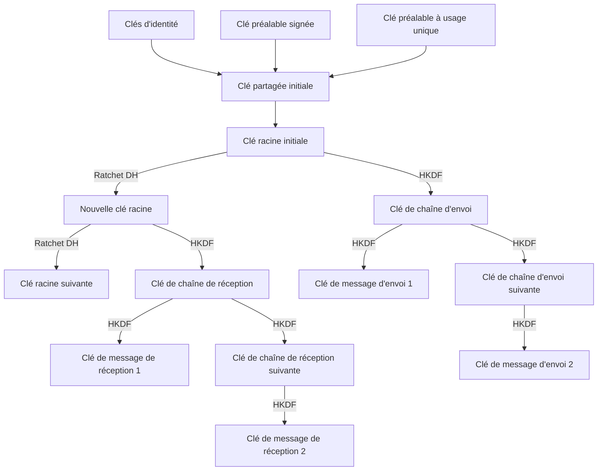

## 3. Établissement de session (X3DH)

### 3.1 Triple Diffie-Hellman (X3DH)

Le protocole X3DH (Extended Triple Diffie-Hellman) permet d'établir une clé partagée secrète entre deux parties, même lorsque l'une d'elles est hors ligne. Il combine trois échanges Diffie-Hellman distincts pour atteindre cet objectif.

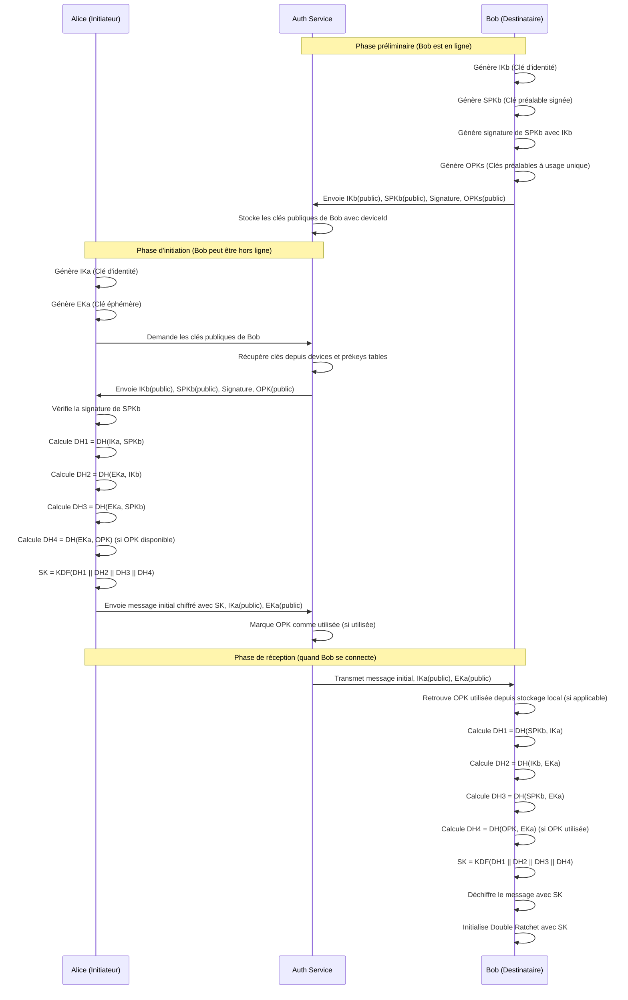

### 3.2 Étapes de l'établissement de session

1. **Phase préliminaire** (préparation du destinataire):
   - Le destinataire génère et enregistre ses clés via auth-service
   - Ces clés comprennent sa clé d'identité publique, sa clé préalable signée et ses clés préalables à usage unique
   - auth-service associe les clés aux appareils dans sa table devices

2. **Phase d'initiation** (par l'expéditeur):
   - L'expéditeur récupère les clés publiques du destinataire depuis auth-service
   - Il génère une clé éphémère
   - Il calcule une série d'échanges Diffie-Hellman pour dériver une clé partagée
   - Il utilise cette clé pour chiffrer un message initial et l'envoie avec ses clés publiques

3. **Phase de réception** (par le destinataire):
   - Le destinataire récupère le message et les clés de l'expéditeur via auth-service
   - Il recalcule la même série d'échanges Diffie-Hellman
   - Il dérive la même clé partagée et déchiffre le message initial
   - Les deux parties disposent maintenant d'un secret partagé pour initialiser l'algorithme Double Ratchet

## 4. Double Ratchet Algorithm

### 4.1 Principes fondamentaux

Le Double Ratchet est l'algorithme central du protocole Signal. Il combine:

1. **Ratchet Diffie-Hellman**: Échange régulier de nouvelles clés publiques pour renouveler le secret partagé
2. **Ratchet Symétrique**: Dérivation progressive de nouvelles clés à partir des secrets partagés

Cette combinaison offre la "forward secrecy" (protection des messages passés) et la "future secrecy" (récupération automatique après compromission).

### 4.2 Fonctionnement du Double Ratchet

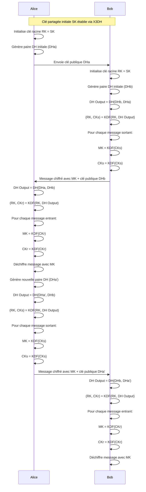

### 4.3 Étapes du processus de Double Ratchet

1. **Initialisation**:
   - Les deux parties initialisent leur état avec la clé partagée (SK) établie via X3DH
   - Chaque partie génère une paire de clés Diffie-Hellman initiale

2. **Ratchet de clé Diffie-Hellman**:
   - À chaque tour, une nouvelle paire de clés DH est générée
   - Un nouvel échange DH est calculé avec la dernière clé publique du destinataire
   - Ce résultat est utilisé pour dériver une nouvelle clé racine et clé de chaîne

3. **Ratchet de chaîne symétrique**:
   - Pour chaque message, une nouvelle clé de message est dérivée de la clé de chaîne
   - La clé de chaîne évolue également à chaque message
   - Chaque message utilise une clé de message unique

4. **Gestion de messages hors séquence**:
   - L'algorithme stocke les clés de message précédentes pour un temps limité
   - Cela permet de déchiffrer les messages arrivant dans le désordre
   - Les clés de message sont supprimées après utilisation ou expiration

## 5. Gestion des clés

### 5.1 Cycle de vie des clés d'identité

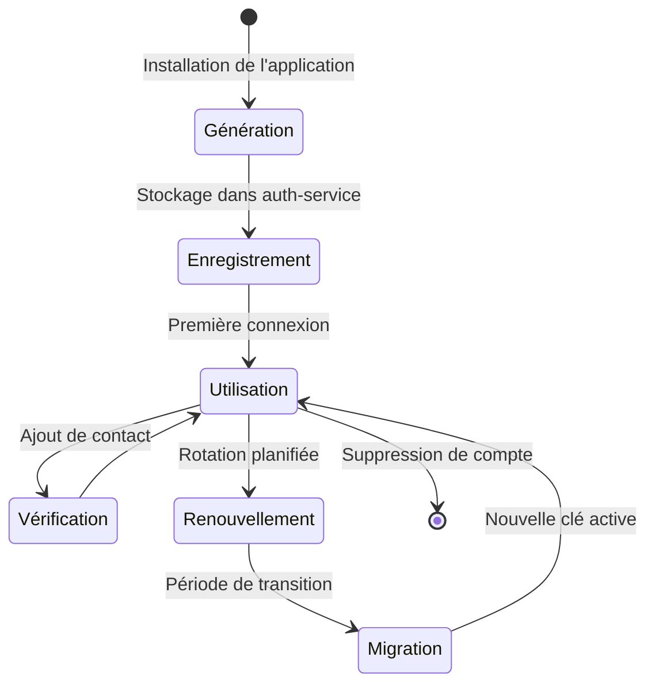

1. **Génération**:
   - Créée lors de l'installation de l'application
   - Stockée exclusivement sur l'appareil (clé privée)
   - La clé publique est enregistrée dans auth-service et associée au deviceId

2. **Utilisation**:
   - Utilisée pour l'authentification des messages
   - Employée dans l'établissement initial de session (X3DH)
   - Sert à signer les clés préalables

3. **Vérification**:
   - Les utilisateurs peuvent vérifier manuellement les clés d'identité via l'interface d'auth-service
   - Cette vérification se fait via des codes de sécurité ou QR codes
   - Marque les clés comme "vérifiées" dans la base auth-service pour plus de sécurité

4. **Renouvellement**:
   - Rotation possible mais peu fréquente (par défaut, tous les 12 mois)
   - Nécessite une procédure spéciale en raison de l'impact sur les sessions existantes
   - Coordonnée par auth-service pour tous les appareils

5. **Migration**:
   - Période pendant laquelle l'ancienne et la nouvelle clé sont acceptées
   - Avertissement aux contacts sur le changement de clé via auth-service
   - Établissement progressif de nouvelles sessions

### 5.2 Gestion des clés préalables signées

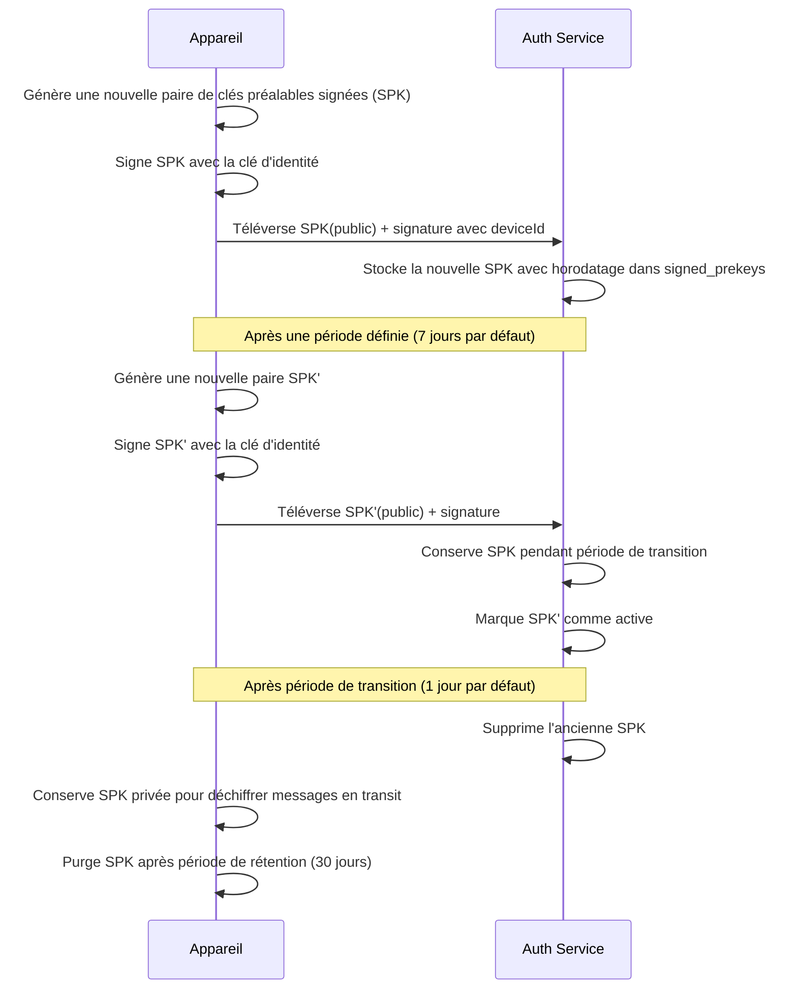

1. **Cycle de rotation**:
   - Nouvelles clés générées régulièrement (typiquement tous les 7 jours)
   - Signées avec la clé d'identité pour authentification
   - Stockées dans auth-service avec leur signature et deviceId

2. **Période de transition**:
   - auth-service conserve l'ancienne et la nouvelle clé pendant une période définie
   - Permet aux sessions en cours d'établissement de se compléter
   - Évite les interruptions de service

3. **Rétention de clés privées**:
   - L'appareil conserve les clés privées périmées pendant une période définie
   - Nécessaire pour déchiffrer les messages envoyés avec ces clés
   - Purge automatique après la période de rétention

### 5.3 Gestion des clés préalables à usage unique

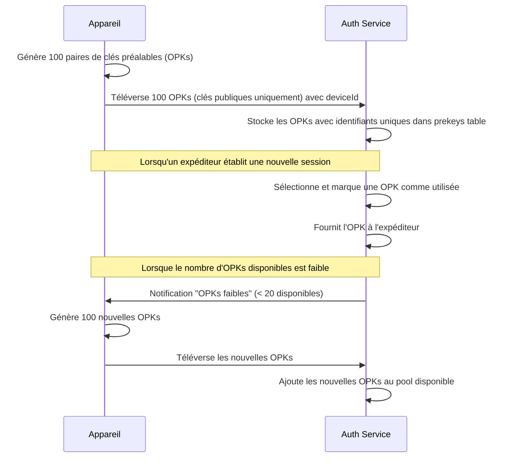

1. **Génération par lot**:
   - Générées en grands nombres (typiquement 100 à la fois)
   - Seules les clés publiques sont téléversées vers auth-service
   - Les clés privées restent exclusivement sur l'appareil
   - Associées au deviceId dans auth-service

2. **Utilisation unique**:
   - Chaque clé est fournie à un seul expéditeur par auth-service
   - Marquée comme utilisée dans la base auth-service
   - Ne peut jamais être réutilisée pour une autre session

3. **Renouvellement**:
   - auth-service surveille le nombre de clés disponibles par appareil
   - Demande de nouvelles clés lorsque le stock devient faible
   - L'appareil génère et téléverse de nouvelles clés préalables

4. **Correspondance et stockage**:
   - L'appareil doit maintenir une correspondance entre IDs et clés privées
   - Permet de retrouver la clé privée correspondant à la clé publique utilisée
   - Nécessaire pour compléter l'établissement de session X3DH

## 6. Chiffrement et authentification des messages

### 6.1 Format des messages chiffrés

```
+-------------------------------------------------------------------------+
| Version (1 octet) | Type de message (1 octet) | ID destinataire (4 oct) |
+-------------------------------------------------------------------------+
| ID expéditeur (4 oct) | ID clé DH (4 oct) | Itération CH (4 oct)       |
+-------------------------------------------------------------------------+
| Clé publique DH (32 oct) | IV (16 oct) | Longueur contenu (4 oct)      |
+-------------------------------------------------------------------------+
| Contenu chiffré (variable) | Tag d'authentification HMAC (32 oct)      |
+-------------------------------------------------------------------------+
```

1. **En-tête** (non chiffré):
   - Version du protocole
   - Type de message (normal, clé préalable, etc.)
   - Identifiants du destinataire et de l'expéditeur (deviceId depuis auth-service)
   - Informations sur les clés utilisées (index, itérations)

2. **Corps chiffré**:
   - Chiffré avec AES-256 en mode CBC ou GCM
   - Vecteur d'initialisation (IV) unique par message
   - Structure interne variable selon le type de message

3. **Authentification**:
   - HMAC-SHA256 calculé sur l'ensemble du message
   - Permet de vérifier l'intégrité et l'authenticité
   - Protège contre les altérations et attaques actives

### 6.2 Processus de chiffrement des messages

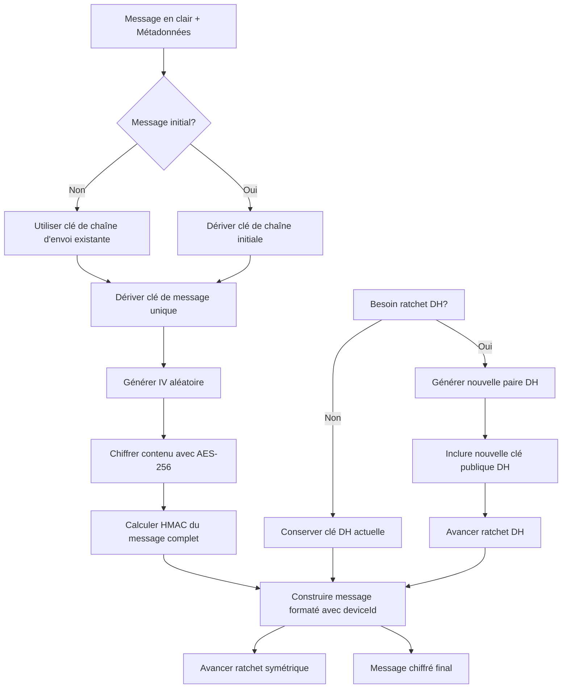

## 7. Gestion multi-appareils

### 7.1 Architecture de sessions multi-appareils

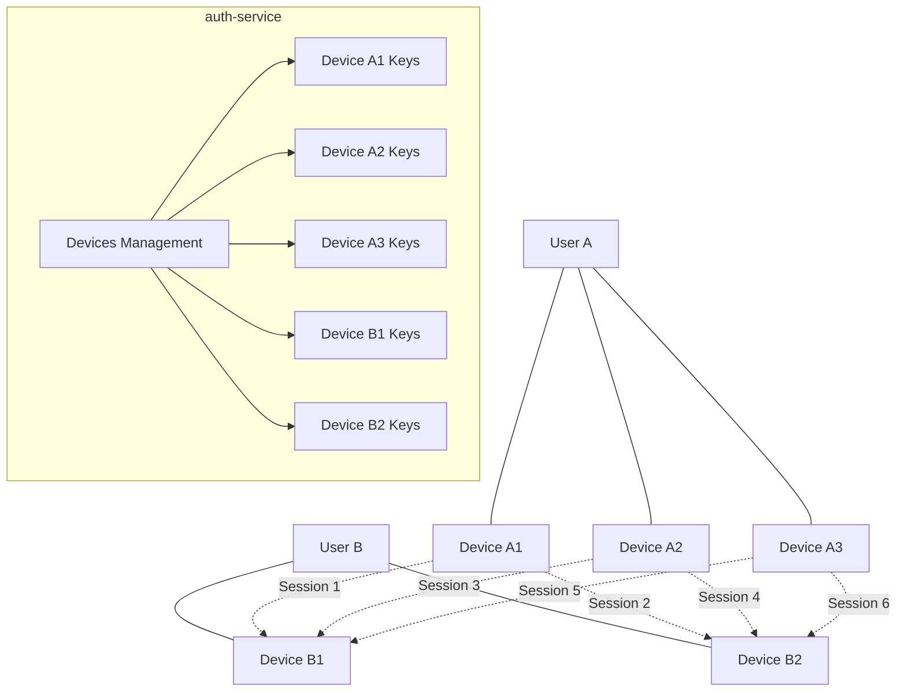

Le protocole Signal traite chaque paire appareil-appareil comme une session cryptographique distincte, avec auth-service gérant les appareils:

1. **Sessions indépendantes**:
   - Chaque appareil d'un utilisateur maintient des sessions distinctes avec chaque appareil de ses contacts
   - Une session est identifiée par une paire (deviceId émetteur, deviceId destinataire) gérée par auth-service

2. **Pas de partage de clés privées**:
   - Les clés privées ne sont jamais partagées entre appareils
   - Chaque appareil génère et gère ses propres clés cryptographiques
   - auth-service stocke uniquement les clés publiques avec association aux deviceId

3. **Architecture en fan-out/fan-in**:
   - Fan-out: Un message envoyé est chiffré séparément pour chaque appareil du destinataire
   - Fan-in: Les messages reçus de différents appareils d'un même contact sont présentés dans une interface unifiée
   - auth-service coordonne la distribution aux différents appareils

### 7.2 Synchronisation de messages entre appareils

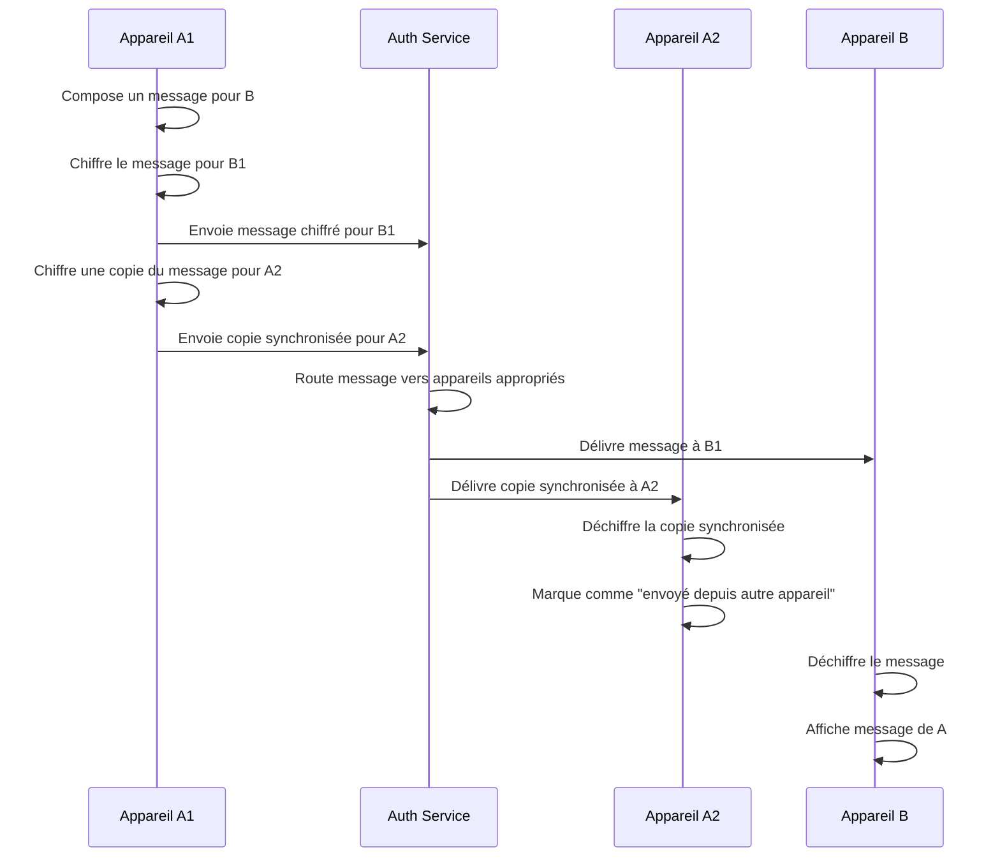

1. **Partage des messages**:
   - Un appareil envoyant un message chiffre une copie pour chacun de ses propres appareils
   - Cette copie est envoyée via auth-service comme "message de synchronisation"
   - auth-service route les messages vers les appareils appropriés selon les deviceId
   - Permet à tous les appareils d'avoir une vue cohérente des conversations

2. **Chiffrement des copies**:
   - Les copies sont chiffrées individuellement comme tout autre message
   - Utilise les sessions Signal établies entre les appareils du même utilisateur
   - Garantit que même auth-service ne peut pas lire les messages synchronisés

3. **Métadonnées spéciales**:
   - Les messages synchronisés contiennent des métadonnées indiquant qu'ils sont des copies
   - L'interface utilisateur les présente comme "envoyés depuis un autre appareil"
   - Évite la confusion et les doublons dans l'interface

### 7.3 Vérification croisée entre appareils

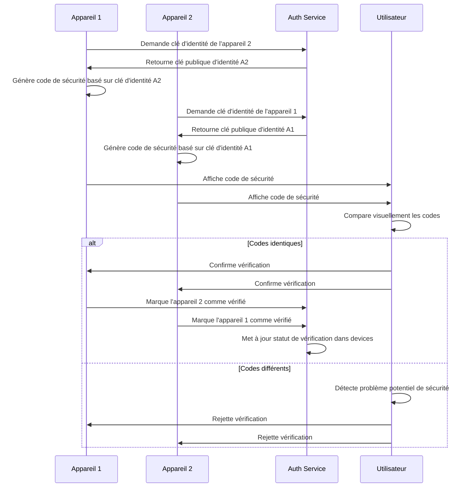

1. **Vérification de cohérence**:
   - Les appareils d'un même utilisateur doivent présenter les mêmes clés d'identité aux contacts
   - La vérification croisée permet de s'assurer qu'aucun appareil n'a été compromis
   - auth-service fournit les clés publiques pour la vérification

2. **Processus de vérification**:
   - Génération de codes de sécurité sur chaque appareil basés sur les clés d'auth-service
   - Comparaison visuelle par l'utilisateur
   - Confirmation ou rejet basé sur la correspondance

3. **Suivi des vérifications**:
   - État de vérification stocké dans auth-service (table devices)
   - Interface utilisateur indiquant le statut de vérification de chaque appareil
   - Alertes en cas de changement inattendu de clés

## 8. Implémentation technique

### 8.1 Bibliothèques et frameworks

L'implémentation du protocole Signal dans Whispr utilisera:

1. **libsignal-protocol-typescript**:
   - Implémentation TypeScript du protocole Signal
   - Adaptation de la bibliothèque officielle pour JavaScript/TypeScript
   - Gestion des primitives cryptographiques et du protocole

2. **Curve25519-XSalsa20-Poly1305**:
   - Boîte cryptographique combinant courbe elliptique et chiffrement symétrique
   - Utilisée pour les opérations cryptographiques de base

3. **HKDF-HMAC-SHA256**:
   - Fonction de dérivation de clés basée sur HMAC
   - Utilisée pour toutes les dérivations de clés dans le protocole

4. **protobuf.js**:
   - Sérialisation et désérialisation efficace des messages
   - Format binaire compact pour la transmission

5. **SQL/IndexedDB**:
   - Stockage local des états de sessions et des clés
   - Optimisé pour les recherches et la persistence

### 8.2 Architecture de l'implémentation

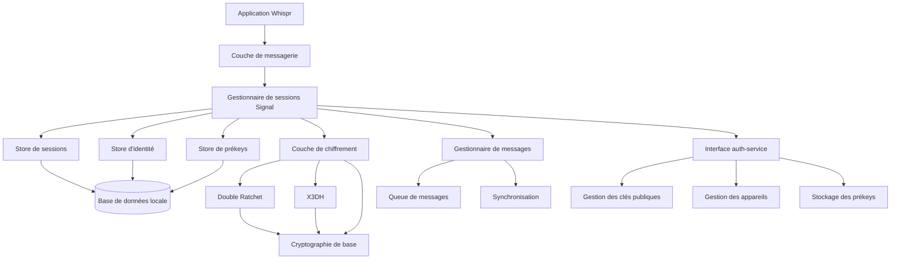

1. **Couche d'application**:
   - Interface avec la logique métier de Whispr
   - Gestion des messages utilisateur et de l'interface

2. **Gestionnaire de sessions Signal**:
   - Cœur de l'implémentation du protocole
   - Maintient l'état de toutes les sessions cryptographiques

3. **Couche de stockage**:
   - Persistence sécurisée des clés et états de sessions
   - Stockage chiffré avec clé dérivée du code d'accès utilisateur

4. **Couche de chiffrement**:
   - Implémentation des algorithmes cryptographiques
   - Double Ratchet, X3DH et primitives associées

5. **Gestionnaire de messages**:
   - Traitement des messages entrants et sortants
   - File d'attente pour les messages en échec
   - Synchronisation multi-appareils

6. **Interface auth-service**:
   - Communication avec auth-service pour la gestion des clés publiques
   - Synchronisation des informations d'appareils
   - Stockage et récupération des prékeys

### 8.3 Sécurisation des clés locales

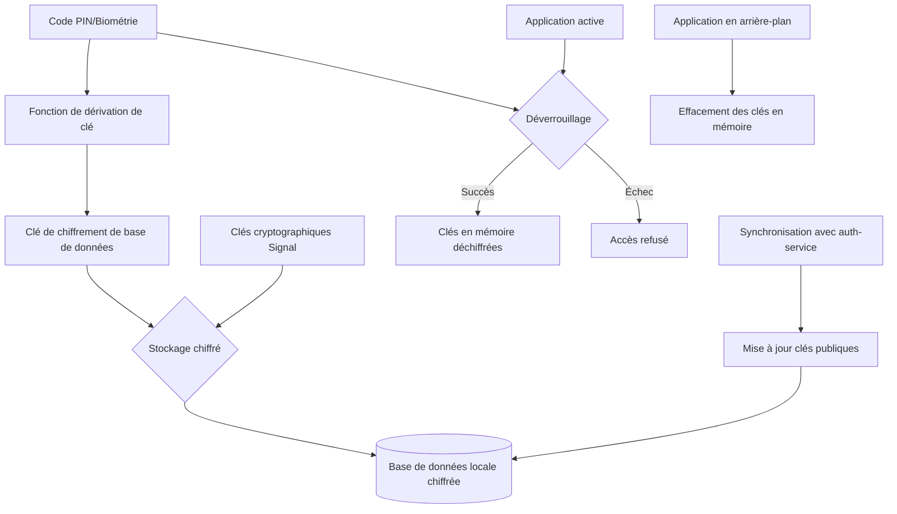

1. **Protection au repos**:
   - Les clés privées sont chiffrées dans la base de données locale
   - Utilisation d'une clé dérivée du code PIN ou de la biométrie de l'utilisateur
   - Chiffrement AES-256 avec sel unique par installation

2. **Protection en mémoire**:
   - Les clés sont chargées en mémoire uniquement lorsque nécessaire
   - Effacement de la mémoire après utilisation (quand possible)
   - Nettoyage complet lors de la mise en arrière-plan de l'application

3. **Synchronisation sécurisée**:
   - Les clés publiques sont synchronisées avec auth-service
   - Les clés privées ne quittent jamais l'appareil
   - Validation des clés publiques reçues d'auth-service

4. **Contre-mesures supplémentaires**:
   - Prévention des captures d'écran sur les écrans sensibles
   - Blocage du débogage sur les builds de production
   - Détection des environnements rootés/jailbreakés

## 9. Tests de sécurité

### 9.1 Tests unitaires

- Génération correcte de clés cryptographiques
- Échanges Diffie-Hellman et dérivation de clés
- Progression correcte des ratchets (symétrique et DH)
- Chiffrement et déchiffrement de messages
- Gestion des messages hors séquence
- Sérialisation et désérialisation des états de session
- Interface avec auth-service pour la gestion des clés

### 9.2 Tests d'intégration

- Établissement complet de sessions X3DH avec auth-service
- Échange de messages bidirectionnel
- Rotation des clés préalables via auth-service
- Synchronisation multi-appareils avec gestion centralisée des deviceId
- Gestion des situations d'erreur et récupération

### 9.3 Tests de sécurité spécifiques

- Vérification de la forward secrecy (compromission de clés futures)
- Vérification de la future secrecy (récupération après compromission)
- Tests de résistance au rejeu (replay attacks)
- Tests d'interception (MITM)
- Validation des signatures et authentification
- Vérification de non-dégradation du protocole
- Sécurité de l'interface avec auth-service

## 10. Livrables

### 10.1 Composants logiciels

- **Module SignalProtocolManager**: Implémentation principale du protocole
- **Service de gestion des clés**: Génération et rotation des clés avec interface auth-service
- **API de chiffrement**: Interface pour les opérations de chiffrement/déchiffrement
- **Base de données sécurisée**: Stockage des clés et états de session
- **Module de synchronisation**: Gestion de la cohérence multi-appareils avec auth-service
- **Interface auth-service**: Module d'intégration avec auth-service pour la gestion des clés publiques

### 10.2 Documentation

- **Spécification d'implémentation**: Guide détaillé pour les développeurs
- **Diagrammes cryptographiques**: Illustrations des processus cryptographiques
- **Documentation API**: Reference pour l'intégration avec les autres modules
- **Guide de sécurité**: Bonnes pratiques pour la manipulation des clés
- **Protocoles de vérification**: Instructions pour la validation cryptographique
- **Documentation d'intégration auth-service**: Guide pour l'interface avec auth-service

### 10.3 Configurations et scripts

- **Scripts de test**: Validation automatisée des primitives cryptographiques
- **Outils de débogage**: Utilitaires pour diagnostiquer les problèmes cryptographiques
- **Outils d'audit**: Vérification de la conformité avec le protocole Signal
- **Scripts de migration**: Migration des clés vers auth-service

---

## Annexes

### A. Glossaire des termes cryptographiques

| Terme | Description |
|-------|-------------|
| DH (Diffie-Hellman) | Protocole d'échange de clés permettant à deux parties de générer un secret partagé sur un canal non sécurisé |
| X3DH | Extended Triple Diffie-Hellman - Protocole d'établissement de session asynchrone |
| HKDF | HMAC-based Key Derivation Function - Fonction de dérivation de clés basée sur HMAC |
| Forward Secrecy | Propriété garantissant que la compromission future d'une clé ne permet pas de déchiffrer les messages passés |
| PreKey | Clé préalable permettant l'établissement asynchrone de session, gérée par auth-service |
| Double Ratchet | Algorithme combinant ratchet symétrique et asymétrique pour la dérivation continue de clés |
| AES-256 | Advanced Encryption Standard - Algorithme de chiffrement symétrique avec clé de 256 bits |
| Curve25519 | Courbe elliptique utilisée pour les opérations de cryptographie asymétrique |
| DeviceId | Identifiant unique d'appareil géré par auth-service |

### B. Matrice de menaces et contrôles

| Menace | Impact | Contrôle |
|--------|--------|----------|
| Interception de messages | Divulgation de contenu | Chiffrement E2E avec AES-256 |
| Compromission de clés à long terme | Usurpation d'identité | Forward secrecy via Double Ratchet |
| Attaque par rejeu | Confusion, répétition de messages | Compteurs et identifiants uniques par message |
| Attaque par homme du milieu | Interception active | Vérification des clés d'identité via auth-service |
| Compromission d'appareil | Accès aux messages | Chiffrement local et verrouillage par code |
| Modification de messages | Intégrité compromise | HMAC-SHA256 sur chaque message |
| Compromission auth-service | Fuite clés publiques | Clés privées restent sur appareils, vérification croisée |

### C. Références

- Signal Protocol Specification: https://signal.org/docs/
- X3DH Key Agreement Protocol: https://signal.org/docs/specifications/x3dh/
- Double Ratchet Algorithm: https://signal.org/docs/specifications/doubleratchet/
- OMEMO Multi-End Message and Object Encryption: XEP-0384
- Forward Secrecy Properties: Trevor Perrin, "The Double Ratchet: Security Notions and Proofs"