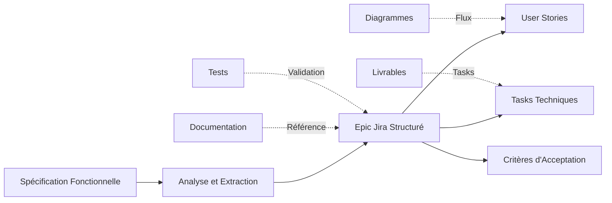
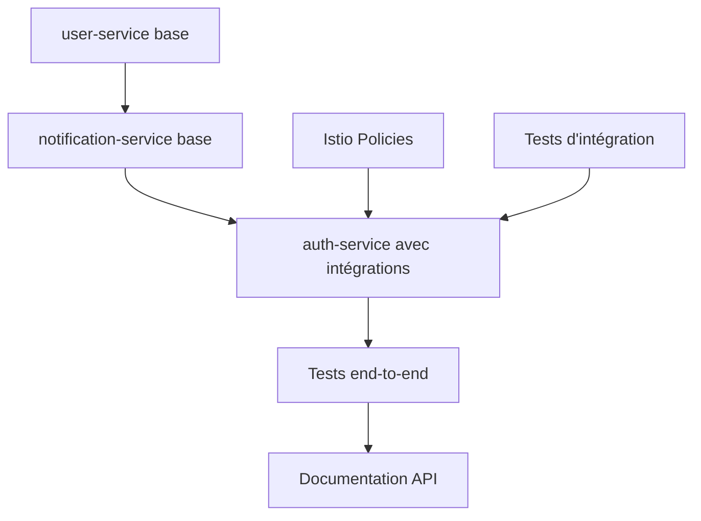

# Guide de Conversion : De la Spécification Fonctionnelle aux Epics Jira

## 0. Sommaire

- [1. Vue d'ensemble du processus](#1-vue-densemble-du-processus)
- [2. Structure d'un Epic Jira basé sur une spécification](#2-structure-dun-epic-jira-basé-sur-une-spécification)
  - [2.1 Titre et Description de l'Epic](#21-titre-et-description-de-lepic)
  - [2.2 Critères d'Acceptation de l'Epic](#22-critères-dacceptation-de-lepic)
- [3. Décomposition en User Stories](#3-décomposition-en-user-stories)
  - [3.1 Méthode d'extraction des User Stories](#31-méthode-dextraction-des-user-stories)
  - [3.2 Exemples concrets](#32-exemples-concrets)
- [4. Création des Tasks Techniques](#4-création-des-tasks-techniques)
  - [4.1 Sources des tasks techniques](#41-sources-des-tasks-techniques)
  - [4.2 Template de task technique](#42-template-de-task-technique)
- [5. Gestion des Dépendances Inter-Services](#5-gestion-des-dépendances-inter-services)
  - [5.1 Identification des dépendances](#51-identification-des-dépendances)
  - [5.2 Ordre de développement](#52-ordre-de-développement)
- [6. Définition de "Done" (DoD) par Epic](#6-définition-de-done-dod-par-epic)
- [7. Bonnes Pratiques pour le Suivi](#7-bonnes-pratiques-pour-le-suivi)
  - [7.1 Traçabilité Documentation ↔ Développement](#71-traçabilité-documentation--développement)
  - [7.2 Mise à jour de la documentation](#72-mise-à-jour-de-la-documentation)
  - [7.3 Communication équipe](#73-communication-équipe)
- [8. Template d'Epic Jira](#8-template-depic-jira)
- [9. Outils Recommandés](#9-outils-recommandés)
- [10. Exemples Complets](#10-exemples-complets)

## 1. Vue d'ensemble du processus

Les documents de spécifications fonctionnelles servent de **source de vérité** pour créer des epics Jira structurés et exploitables.

Voici comment transformer efficacement une spécification en epic de développement :



**Objectifs de cette méthode :**
- **Traçabilité complète** entre spécifications et développement
- **Cohérence** dans la planification et l'exécution
- **Qualité** grâce aux critères d'acceptation précis
- **Efficacité** via des templates réutilisables

## 2. Structure d'un Epic Jira basé sur une spécification

### 2.1 Titre et Description de l'Epic

**Format recommandé :**
```
Titre : [Nom du Composant] - [Fonctionnalité Principale]
Exemple : "Auth Service - Processus d'Authentification Multi-Appareils"

Description :
- Objectif : [Extraire de la section "Objectif" de la spécification]
- Périmètre : [Résumer les composants fonctionnels]
- Services impliqués : [Lister les services et leurs responsabilités]
- Lien vers spécification : [URL du document de spécification]
```

**Exemple concret pour l'authentification :**
```markdown
## Epic : Auth Service - Processus d'Authentification Multi-Appareils

### Description
Implémentation du système d'authentification sécurisé permettant aux utilisateurs de se connecter via vérification SMS et de gérer plusieurs appareils avec authentification par QR code.

**Services impliqués :**
- auth-service : Génération de tokens, vérification SMS, coordination QR
- user-service : Vérification des comptes utilisateur
- notification-service : Gestion et enregistrement des appareils

**Spécification de référence :**
[📖 Spécification Authentification](./1_authentication.md)
```

### 2.2 Critères d'Acceptation de l'Epic

Transformer les **"Mesures de sécurité"** et **"Règles métier"** de la spécification en critères d'acceptation :

```gherkin
⚪️ GIVEN un utilisateur avec un numéro de téléphone valide
   WHEN il demande un code de vérification
   THEN un code à 6 chiffres est généré et envoyé par SMS avec TTL de 15 minutes

⚪️ GIVEN un code de vérification expiré
   WHEN l'utilisateur tente de l'utiliser
   THEN le système retourne une erreur et demande un nouveau code

⚪️ GIVEN 5 tentatives de code incorrect
   WHEN l'utilisateur fait une 6ème tentative
   THEN le compte est temporairement bloqué pour 30 minutes

⚪️ GIVEN un appareil authentifié scannant un QR code
   WHEN l'utilisateur confirme l'ajout du nouvel appareil
   THEN le nouvel appareil reçoit des tokens valides et un deviceId unique
```

## 3. Décomposition en User Stories

### 3.1 Méthode d'extraction des User Stories

1. **Analyser les diagrammes de séquence** : Chaque interaction principale devient une user story
2. **Identifier les acteurs** : Utilisateur, Admin, Système, Services externes
3. **Extraire les actions** : Chaque action significative dans le processus
4. **Regrouper les actions liées** : Une user story = un objectif utilisateur complet

### 3.2 Exemples concrets

**À partir de la spécification d'authentification :**

```markdown
🔹 User Story 1 : Demande de code de vérification
   En tant qu'utilisateur souhaitant me connecter,
   Je veux pouvoir demander un code de vérification par SMS,
   Afin de confirmer l'accès à mon numéro de téléphone.

   Critères d'acceptation :
   - [ ] Le numéro de téléphone est validé au format E.164
   - [ ] Un code à 6 chiffres est généré aléatoirement
   - [ ] Le code est envoyé via service SMS externe
   - [ ] TTL de 15 minutes appliqué au code
   - [ ] Rate limiting : max 5 demandes/heure par numéro

🔹 User Story 2 : Validation du code de vérification
   En tant qu'utilisateur ayant reçu un code SMS,
   Je veux pouvoir saisir ce code pour finaliser ma connexion,
   Afin d'accéder à l'application de manière sécurisée.

   Critères d'acceptation :
   - [ ] Le code saisi est comparé au hash stocké
   - [ ] Maximum 5 tentatives autorisées
   - [ ] Blocage temporaire après échecs répétés
   - [ ] Nettoyage automatique des codes expirés

🔹 User Story 3 : Enregistrement automatique d'appareil
   En tant qu'utilisateur me connectant depuis un nouvel appareil,
   Je veux que mon appareil soit automatiquement enregistré,
   Afin de pouvoir recevoir des notifications et accéder aux fonctionnalités.

   Critères d'acceptation :
   - [ ] Communication sécurisée avec notification-service
   - [ ] Métadonnées d'appareil collectées (type, nom, FCM token)
   - [ ] DeviceId unique attribué et inclus dans les tokens
   - [ ] Journalisation de l'événement d'enregistrement
```

## 4. Création des Tasks Techniques

### 4.1 Sources des tasks techniques

1. **Section "Livrables"** → Tasks de développement des modules
2. **Diagrammes de séquence** → Appels API et intégrations inter-services
3. **Section "Tests"** → Tasks de validation et qualité
4. **Section "Considérations opérationnelles"** → Tasks DevOps et infrastructure

### 4.2 Template de task technique

```markdown
📋 Task : [Service] - [Composant] - [Action spécifique]

**Description :**
Implémentation de [fonctionnalité] selon la spécification [lien].

**Référence spécification :** [Lien vers section spécifique]
**Service concerné :** [auth-service/user-service/notification-service]
**Dépendances :** [Autres tasks ou services requis]

**Critères d'acceptation :**
- [ ] Code implémenté selon la spécification
- [ ] Tests unitaires passent (couverture > 70%)
- [ ] Tests d'intégration avec services dépendants validés
- [ ] Documentation technique mise à jour
- [ ] Politiques de sécurité Istio configurées (si applicable)

**Estimation :** [Story points]
**Labels :** [backend, security, integration]
```

**Exemples de tasks pour l'authentification :**

```markdown
📋 AUTH-TASK-001 : Auth Service - Verification Module - SMS Integration
- Implémenter l'intégration avec service SMS externe (Twilio)
- Gestion des erreurs et retry automatique
- Configuration via variables d'environnement

📋 AUTH-TASK-002 : Auth Service - Token Module - JWT Generation
- Génération de tokens JWT avec deviceId inclus
- Signature ES256 et validation des claims
- Gestion des tokens de rafraîchissement

📋 AUTH-TASK-003 : Integration - Auth to Notification - Device Registration
- Communication gRPC over mTLS vers notification-service
- Enregistrement coordonné des nouveaux appareils
- Gestion des erreurs de communication inter-services
```

## 5. Gestion des Dépendances Inter-Services

### 5.1 Identification des dépendances

À partir des diagrammes de séquence, identifier :
- **Appels gRPC** entre services et leur direction
- **Ordre des implémentations** (quel service doit être prêt en premier)
- **Données partagées** (tables, événements, formats de message)
- **Configurations Istio** (AuthorizationPolicies, PeerAuthentication)

### 5.2 Ordre de développement

**Exemple pour l'écosystème d'authentification :**



Ordre de développement recommandé :

**Phase 1 : Services de base**
- `user-service` : CRUD utilisateurs, vérification des comptes
- `notification-service` : CRUD appareils, tokens FCM/APNS

**Phase 2 : Intégrations**
- `auth-service` : Authentification avec appels inter-services
- Configuration Istio : AuthorizationPolicies et mTLS

**Phase 3 : Tests et validation**
- Tests d'intégration inter-services
- Tests de charge et sécurité
- Documentation API complète

**Dépendances critiques :**
- `auth-service` dépend de `user-service` pour vérifier les comptes
- `auth-service` dépend de `notification-service` pour enregistrer les appareils
- Tous les services nécessitent les configurations Istio pour la sécurité

## 6. Définition de "Done" (DoD) par Epic

**DoD basée sur les spécifications fonctionnelles :**

```markdown
## Definition of Done - Epic Authentification

### ⚪️ Développement
- [ ] Tous les endpoints API spécifiés sont implémentés et documentés
- [ ] Tous les diagrammes de séquence sont respectés et fonctionnels
- [ ] Communications inter-services via gRPC over mTLS opérationnelles
- [ ] Rate limiting et mesures de sécurité implémentées selon spécification
- [ ] Gestion d'erreurs cohérente avec les codes de retour spécifiés

### ⚪️ Tests
- [ ] Tests unitaires : couverture > 70% pour tous les modules
- [ ] Tests d'intégration inter-services passent (auth ↔ user, auth ↔ notification)
- [ ] Tests de sécurité validés selon la matrice de menaces
- [ ] Tests de charge pour les endpoints critiques (vérification SMS)
- [ ] Tests de bout en bout pour tous les flux utilisateur

### ⚪️ Sécurité et Conformité
- [ ] Politiques Istio (AuthorizationPolicy, PeerAuthentication) configurées
- [ ] Audit de sécurité basé sur la matrice de menaces de la spécification
- [ ] Chiffrement des données sensibles (codes, tokens) vérifié
- [ ] Logs de sécurité fonctionnels et conformes RGPD
- [ ] Validation par l'équipe sécurité (David/Tudy)

### ⚪️ Documentation et Déploiement
- [ ] Documentation API (Swagger) générée et à jour
- [ ] Guide d'intégration pour les équipes frontend/mobile
- [ ] Scripts de déploiement automatisés et testés
- [ ] Monitoring et alertes configurés selon les métriques spécifiées
- [ ] Runbooks pour les incidents courants

### ⚪️ Validation Produit
- [ ] Démonstration des flux utilisateur principaux réussie
- [ ] Tests d'acceptance par l'équipe produit
- [ ] Performance conforme aux exigences (< 200ms response time)
- [ ] Tests utilisateur sur tous les scénarios spécifiés
- [ ] Validation de l'expérience utilisateur (UX)
```

## 7. Bonnes Pratiques pour le Suivi

### 7.1 Traçabilité Documentation ↔ Développement

**Liens bidirectionnels requis :**
- Epic Jira → Référence explicite vers la spécification fonctionnelle
- Spécification → Mention de l'epic Jira correspondant en en-tête
- Pull Request GitHub → Référence automatique vers les user stories Jira
- Tests automatisés → Vérifient les critères de la spécification
- Documentation API → Cohérente avec les endpoints spécifiés

**Format des références :**
- Dans Jira : "Spec: [Nom du document](URL)"
- Dans les specs : "Epic Jira: [EPIC-123](URL)"
- Dans les PRs : "Fixes STORY-456, refs EPIC-123"

### 7.2 Mise à jour de la documentation

**Processus de synchronisation :**

1. **Modification de spécification** → Mise à jour automatique de l'epic
   - Notification Slack vers l'équipe
   - Review des user stories impactées
   - Adaptation des critères d'acceptation

2. **Changement technique** → Update des user stories
   - Impact assessment sur les autres services
   - Mise à jour des dépendances
   - Communication aux équipes concernées

3. **Nouvelle contrainte** → Ajout de critère d'acceptation
   - Évaluation de l'impact planning
   - Tests supplémentaires requis
   - Validation par le product owner

4. **Bug découvert** → Enrichissement des tests spécifiés
   - Ajout de cas de test manquants
   - Renforcement des critères d'acceptation
   - Documentation du fix dans la spécification

### 7.3 Communication équipe

**Points de synchronisation obligatoires :**

**Sprint Planning :**
- Révision des spécifications pour les stories sélectionnées
- Validation des dépendances inter-équipes
- Estimation basée sur la complexité des spécifications

**Daily Stand-up :**
- Blocages liés aux dépendances inter-services
- Écarts par rapport aux spécifications
- Besoins de clarification technique

**Sprint Review :**
- Démonstration conforme aux critères de la spécification
- Validation des flux utilisateur spécifiés
- Feedback pour améliorer les spécifications

**Retrospective :**
- Efficacité du processus de conversion spéc → epic
- Qualité des critères d'acceptation
- Amélioration de la traçabilité

## 8. Template d'Epic Jira

```markdown
## Epic : [Service] - [Fonctionnalité]

### 📋 Description
[Objectif extrait de la section "Objectif" de la spécification]

**Services impliqués :** [Liste avec responsabilités]
**Spécification de référence :** [Lien vers le document]
**Équipe responsable :** [Nom de l'équipe]
**Sprint cible :** [Sprint de livraison prévu]

### 🎯 Objectifs Business
- [ ] [Objectif 1 basé sur les composants fonctionnels]
- [ ] [Objectif 2 extrait des principes clés]
- [ ] [Objectif 3 selon les livrables attendus]

### ⚪️ Critères d'Acceptation Epic
[Transformés des mesures de sécurité et règles métier en format Given/When/Then]

### 🔗 User Stories
- [STORY-123] - [Titre user story 1] - [Points] - [Status]
- [STORY-124] - [Titre user story 2] - [Points] - [Status]
- [STORY-125] - [Titre user story 3] - [Points] - [Status]

### 🛠️ Tasks Techniques Transverses
- [TASK-456] - Configuration Istio AuthorizationPolicies - [2pts]
- [TASK-457] - Mise en place monitoring spécifique - [3pts]
- [TASK-458] - Documentation API et guides d'intégration - [2pts]

### 📊 Métriques de Succès
- **Performance :** Temps de réponse < [Valeur spécification]
- **Fiabilité :** Taux d'erreur < [Valeur spécification]
- **Qualité :** Couverture de tests > 70%
- **Sécurité :** 0 vulnérabilité critique détectée

### 🔒 Exigences de Sécurité
[Mesures de sécurité extraites directement de la spécification]
- Rate limiting configuré selon spécifications
- Communications inter-services via mTLS
- Chiffrement des données sensibles
- Audit et logging de sécurité

### 🏗️ Architecture
[Schéma simplifié des services impliqués]
auth-service ↔ user-service (gRPC over mTLS)
auth-service ↔ notification-service (gRPC over mTLS)

### 📝 Notes et Risques
**Dépendances identifiées :**
- [Service X] doit être prêt avant [Service Y]
- Configuration Istio requise avant les tests d'intégration

**Risques techniques :**
- Complexité de synchronisation inter-services
- Performance des appels gRPC en cascade

**Points d'attention :**
- Validation par l'équipe sécurité obligatoire
- Tests de charge sur les endpoints critiques
```

## 9. Outils Recommandés

### **Pour la conversion et planification :**
- **Miro/Lucidchart** : Visualiser les dépendances entre user stories et services
- **Confluence** : Créer des templates d'epic réutilisables et la documentation
- **Jira Advanced Roadmaps** : Planifier les dépendances inter-équipes et inter-services

### **Pour le développement et suivi :**
- **GitHub** : Liens automatiques entre PRs et tickets Jira via Smart Commits
- **Slack** : Notifications automatiques des mises à jour de spécifications
- **Postman/Insomnia** : Collections de tests d'API basées sur les spécifications

### **Pour la qualité et validation :**
- **SonarQube** : Analyse de code selon les exigences de qualité spécifiées
- **k6/Artillery** : Tests de charge basés sur les métriques de performance
- **OWASP ZAP** : Tests de sécurité selon la matrice de menaces

## 10. Exemples Complets

### 10.1 Epic Authentification - Exemple Réel

```markdown
## Epic : AUTH-EPIC-001 - Système d'Authentification Multi-Appareils

### 📋 Description
Implémentation complète du système d'authentification sécurisé permettant l'inscription, la connexion via SMS, et la gestion multi-appareils avec QR code.

**Services impliqués :**
- auth-service : Coordination authentification, tokens JWT, vérification SMS
- user-service : Validation comptes utilisateur, CRUD profils
- notification-service : Gestion appareils, tokens FCM/APNS

**Spécification de référence :** [📖 Authentification Whispr](./1_authentication.md)
**Équipe responsable :** Team Backend Core
**Sprint cible :** Sprint 3-4

### 🎯 Objectifs Business
- [ ] Permettre l'inscription sécurisée via vérification SMS
- [ ] Implémenter la connexion sans mot de passe
- [ ] Supporter l'authentification multi-appareils via QR code
- [ ] Garantir la sécurité par mTLS entre tous les services

### ⚪️ Critères d'Acceptation Epic
```gherkin
⚪️ GIVEN un utilisateur avec un numéro valide
   WHEN il demande un code de vérification
   THEN un code 6 chiffres est envoyé par SMS avec TTL 15min

⚪️ GIVEN un appareil authentifié scannant un QR code valide
   WHEN l'utilisateur confirme l'ajout
   THEN le nouvel appareil reçoit des tokens avec deviceId unique

⚪️ GIVEN 5 tentatives de code incorrect
   WHEN l'utilisateur fait une 6ème tentative
   THEN le compte est bloqué temporairement 30 minutes

### 🔗 User Stories (13 points total)
- [AUTH-STORY-001] - Demande code vérification SMS - [2pts] - [Ready]
- [AUTH-STORY-002] - Validation code et inscription - [3pts] - [In Progress]
- [AUTH-STORY-003] - Connexion utilisateur existant - [2pts] - [Ready]
- [AUTH-STORY-004] - Génération et validation tokens JWT - [3pts] - [Ready]
- [AUTH-STORY-005] - Authentification QR code inter-appareils - [3pts] - [Backlog]

### 🛠️ Tasks Techniques Transverses (7 points total)
- [AUTH-TASK-001] - Configuration Istio mTLS policies - [2pts] - [Todo]
- [AUTH-TASK-002] - Monitoring Prometheus + alertes - [3pts] - [Todo]
- [AUTH-TASK-003] - Documentation API Swagger - [2pts] - [Todo]

### 📊 Métriques de Succès
- **Performance :** < 200ms pour validation SMS
- **Fiabilité :** < 0.1% taux d'erreur
- **Qualité :** > 70% couverture tests
- **Sécurité :** 0 vulnérabilité critique

### 🔒 Exigences de Sécurité
- Rate limiting : 5 SMS/heure par numéro
- Communications gRPC over mTLS (Istio)
- Tokens JWT signés ES256
- Codes SMS hachés en Redis avec TTL

### 📝 Notes et Risques
**Dépendances :** user-service et notification-service doivent être opérationnels
**Risque :** Performance des appels gRPC en cascade pour QR code
**Validation :** Équipe sécurité (David/Tudy/Imane) avant release
```

Cette approche garantit une transformation systématique et de qualité de vos spécifications fonctionnelles en epics Jira exploitables et traçables.
